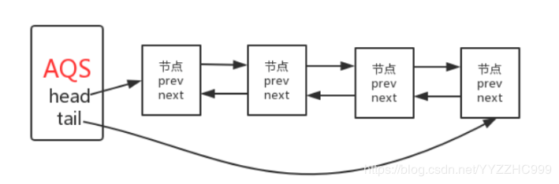

# AQS(AbstractQueuedSynchronizer)

## AQS是什么？
在 Lock 中，用到了一个同步队列 AQS，全称 AbstractQueuedSynchronizer，它是一个同步工具, 也是 Lock 用来实现线程同步的核心组件， 如果你搞懂了 AQS，那么 J.U.C 中绝大部分的工具都能轻松掌握；

## AQS的内部实现

AQS 队列内部维护的是一个 FIFO 的双向链表，这种结构的特点是每个数据结构都有两个指针，分别指向直接的后继节点和直接前驱节点。所以双向链表可以从任意一个节点开始很方便的访问前驱和后继。每个 Node 其实是由一个线程封装，当线程争抢锁失败后会封装成 Node 加入到 ASQ 队列中去；当获取锁的线程释放锁以后，会从队列中唤醒一个阻塞的节点(阻塞的线程)。
AQS中连个重要的成员变量

```
private transient volatile Node head; 		// 头节点
private transient volatile Node tail; 		// 尾节点
```



## Node的内部实现

```
static final class Node {
        /** Marker to indicate a node is waiting in shared mode */
        // 共享模式时
        static final Node SHARED = new Node();
        /** Marker to indicate a node is waiting in exclusive mode */
        // 独占模式时
        static final Node EXCLUSIVE = null;

        /** waitStatus value to indicate thread has cancelled */
        static final int CANCELLED =  1;  //节点从同步队列中取消
        /** waitStatus value to indicate successor's thread needs unparking */
        static final int SIGNAL    = -1; //后继节点的线程处于等待状态，
      	  								如果当前节点释放同步状态会通知后继节点，
        					使得后继节点的线程能够运行； （只有处于singal状态的节点才能被唤醒）
        /** waitStatus value to indicate thread is waiting on condition */
        static final int CONDITION = -2;
        /**
         * waitStatus value to indicate the next acquireShared should
         * unconditionally propagate
         */
        static final int PROPAGATE = -3; // 表示下一次共享式同步状态获取将会无条件传播下去

        volatile int waitStatus; //节点状态       
        volatile Node prev;
        volatile Node next;
        volatile Thread thread; //加入同步队列的线程引用

        Node nextWaiter;   // condition队列中的后继节点
			// 是否为共享锁 	
            final boolean isShared() {
            return nextWaiter == SHARED;
        }

        /**
         * 返回前驱节点
         */
        final Node predecessor() throws NullPointerException {
            Node p = prev;
            if (p == null)
                throw new NullPointerException();
            else
                return p;
        }

        Node() {    // Used to establish initial head or SHARED marker
        }	
        // 将线程构造成一个node节点，添加到等待队列（condition队列）
        Node(Thread thread, Node mode) {     // Used by addWaiter
            this.nextWaiter = mode;
            this.thread = thread;
        }

        // 等待队列用到的方法
        Node(Thread thread, int waitStatus) { // Used by Condition
            this.waitStatus = waitStatus;
            this.thread = thread;
        }
    }

```

## AQS的两种功能？

### 独占锁和共享锁


**独占锁**：
每次只能有一个线程持有锁，比如ReentrantLock就是以独占方式实现的互斥锁；

**几个重要的方法**：
```
void acquire(int arg)：独占式获取同步状态，如果获取失败则插入同步队列进行等待；
void acquireInterruptibly(int arg)：与acquire方法相同，但在同步队列中进行等待的时候可以检测中断；
boolean tryAcquireNanos(int arg, long nanosTimeout)：在acquireInterruptibly基础上增加了超时等待功能，在超时时间内没有获得同步状态返回false;
boolean release(int arg)：释放同步状态，该方法会唤醒在同步队列中的下一个节点
```

入口：
```
acquire(int arg) 方法为AQS提供的模板方法，该方法为独占式获取同步状态，但是该方法对中断不敏感，也就是说由于线程获取同步状态失败加入到CLH同步队列中，后续对线程进行中断操作时，线程不会从同步队列中移除。代码如下：

// 独占锁入口    
public final void acquire(int arg) {
        if (!tryAcquire(arg) &&
            acquireQueued(addWaiter(Node.EXCLUSIVE), arg))
            selfInterrupt();
    }

```

- tryAcquire：去尝试获取锁，获取成功则设置锁状态并返回true，否则返回false。该方法自定义同步组件自己实现，该方法必须要保证线程安全的获取同步状态。
- addWaiter：如果tryAcquire返回FALSE（获取同步状态失败），则调用该方法将当前线程加入到CLH同步队列尾部。
- acquireQueued：当前线程会根据公平性原则来进行阻塞等待（自旋）,直到获取锁为止；并且返回当前线程在等待过程中有没有中断过。
- selfInterrupt：产生一个中断。

**共享锁**：
允许多个线程同时获取锁，并发访问共享资源，例如：ReentrantReadWriteLock，CountDownLatch；

几个重要的方法：
```
void acquireShared(int arg)：共享式获取同步状态，与独占式的区别在于同一时刻有多个线程获取同步状态；
void acquireSharedInterruptibly(int arg)：在acquireShared方法基础上增加了能响应中断的功能；
boolean tryAcquireSharedNanos(int arg, long nanosTimeout)：在acquireSharedInterruptibly基础上增加了超时等待的功能； boolean releaseShared(int arg)：共享式释放同步状态
```
入口：

```
// 共享锁入口
public final void acquireShared(int arg) {        
    if (tryAcquireShared(arg) < 0)            //获取失败，自旋获取同步状态            
        doAcquireShared(arg);    
}

```

tryAcquireShared(int arg)方法尝试获取同步状态，返回值为int，当其 >= 0 时，表示能够获取到同步状态，这个时候就可以从自旋过程中退出。
如果获取失败则调用doAcquireShared(int arg)自旋方式获取同步状态，共享式获取同步状态的标志是返回 >= 0 的值表示获取成功;
acquireShared(int arg)方法不响应中断，与独占式相似，AQS也提供了响应中断、超时的方法，分别是：acquireSharedInterruptibly(int arg)、tryAcquireSharedNanos(int arg,long nanos)，这里就不做解释了。

## 总结
AQS的主要使用方式是继承，子类通过继承同步器并实现它的抽象方法来管理同步状态，后续会详细分析子类，ReentrantLock以及ReentrantReadWriteLock的具体实现。
