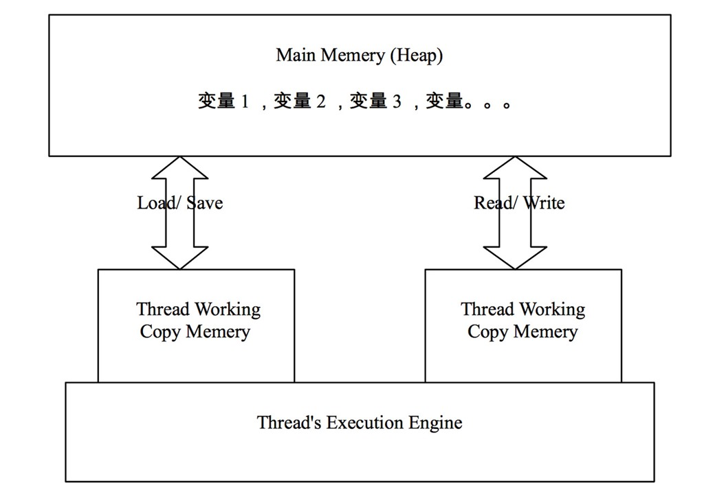

# java内存模型JMM理解整理

## 什么是JMM

JMM即为JAVA 内存模型（java memory model）。因为在不同的硬件生产商和不同的操作系统下，内存的访问逻辑有一定的差异，结果就是当你的代码在某个系统环境下运行良好，并且线程安全，但是换了个系统就出现各种问题。Java内存模型，就是为了屏蔽系统和硬件的差异，让一套代码在不同平台下能到达相同的访问结果。JMM从java 5开始的JSR-133发布后，已经成熟和完善起来。

## 内存划分

JMM规定了内存主要划分为主内存和工作内存两种。此处的主内存和工作内存跟JVM内存划分（堆、栈、方法区）是在不同的层次上进行的，如果非要对应起来，主内存对应的是Java堆中的对象实例部分，工作内存对应的是栈中的部分区域，从更底层的来说，主内存对应的是硬件的物理内存，工作内存对应的是寄存器和高速缓存。

  

JVM在设计时候考虑到，如果JAVA线程每次读取和写入变量都直接操作主内存，对性能影响比较大，所以每条线程拥有各自的工作内存，工作内存中的变量是主内存中的一份拷贝，线程对变量的读取和写入，直接在工作内存中操作，而不能直接去操作主内存中的变量。但是这样就会出现一个问题，当一个线程修改了自己工作内存中变量，对其他线程是不可见的，会导致线程不安全的问题。因为JMM制定了一套标准来保证开发者在编写多线程程序的时候，能够控制什么时候内存会被同步给其他线程。

## 内存交互操作

内存交互操作有8种，虚拟机实现必须保证每一个操作都是原子的，不可在分的（对于double和long类型的变量来说，load、store、read和write操作在某些平台上允许例外）

- lock     （锁定）：作用于主内存的变量，把一个变量标识为线程独占状态
- unlock （解锁）：作用于主内存的变量，它把一个处于锁定状态的变量释放出来，释放后的变量才可以被其他线程锁定
- read    （读取）：作用于主内存变量，它把一个变量的值从主内存传输到线程的工作内存中，以便随后的load动作使用
- load     （载入）：作用于工作内存的变量，它把read操作从主存中变量放入工作内存中
- use      （使用）：作用于工作内存中的变量，它把工作内存中的变量传输给执行引擎，每当虚拟机遇到一个需要使用到变量的值，就会使用到这个指令
- assign  （赋值）：作用于工作内存中的变量，它把一个从执行引擎中接受到的值放入工作内存的变量副本中
- store    （存储）：作用于主内存中的变量，它把一个从工作内存中一个变量的值传送到主内存中，以便后续的write使用
- write 　（写入）：作用于主内存中的变量，它把store操作从工作内存中得到的变量的值放入主内存的变量中

JMM对这八种指令的使用，制定了如下规则：

- 不允许read和load、store和write操作之一单独出现。即使用了read必须load，使用了store必须write
- 不允许线程丢弃他最近的assign操作，即工作变量的数据改变了之后，必须告知主存
- 不允许一个线程将没有assign的数据从工作内存同步回主内存
- 一个新的变量必须在主内存中诞生，不允许工作内存直接使用一个未被初始化的变量。就是怼变量实施use、store操作之前，必须经过assign和load操作
- 一个变量同一时间只有一个线程能对其进行lock。多次lock后，必须执行相同次数的unlock才能解锁
- 如果对一个变量进行lock操作，会清空所有工作内存中此变量的值，在执行引擎使用这个变量前，必须重新load或assign操作初始化变量的值
- 如果一个变量没有被lock，就不能对其进行unlock操作。也不能unlock一个被其他线程锁住的变量
- 对一个变量进行unlock操作之前，必须把此变量同步回主内存 

JMM对这八种操作规则和对volatile的一些特殊规则就能确定哪里操作是线程安全，哪些操作是线程不安全的了。但是这些规则实在复杂，很难在实践中直接分析。所以一般我们也不会通过上述规则进行分析。更多的时候，使用java的happen-before规则来进行分析。

## 模型特征

**原子性**：例如上面八项操作，在操作系统里面是不可分割的单元。被synchronized关键字或其他锁包裹起来的操作也可以认为是原子的。从一个线程观察另外一个线程的时候，看到的都是一个个原子性的操作。
```
synchronized (this) {
       a=1;
       b=2;
}
```
例如一个线程观察另外一个线程执行上面的代码，只能看到a、b都被赋值成功结果，或者a、b都尚未被赋值的结果。

**可见性**：每个工作线程都有自己的工作内存，所以当某个线程修改完某个变量之后，在其他的线程中，未必能观察到该变量已经被修改。volatile关键字要求被修改之后的变量要求立即更新到主内存，每次使用前从主内存处进行读取。因此volatile可以保证可见性。除了volatile以外，synchronized和final也能实现可见性。synchronized保证unlock之前必须先把变量刷新回主内存。final修饰的字段在构造器中一旦完成初始化，并且构造器没有this逸出，那么其他线程就能看到final字段的值。

**有序性**：java的有序性跟线程相关。如果在线程内部观察，会发现当前线程的一切操作都是有序的。如果在线程的外部来观察的话，会发现线程的所有操作都是无序的。因为JMM的工作内存和主内存之间存在延迟，而且java会对一些指令进行重新排序。volatile和synchronized可以保证程序的有序性，很多程序员只理解这两个关键字的执行互斥，而没有很好的理解到volatile和synchronized也能保证指令不进行重排序。


## Volatile内存语义

Java5之前，JMM对Volatile的定义是：保证读写volatile都直接发生在main memory中，线程的working memory不进行缓存.

在Java5之后，JMM对volatile的语义进行了增强,volatile变量法则：对volatile域的写入操作happens-before于每一个后续对同一个域的读写操作。

## Final域的内存语义

被final修饰的变量，相比普通变量，内存语义有一些不同。具体如下：

- JMM禁止把Final域的写重排序到构造器的外部。
- 在一个线程中，初次读该对象和读该对象下的Final域，JMM禁止处理器重新排序这两个操作。

```
 1 public class FinalConstructor {
 2 
 3     final int a; //这个是直接内存，不会重排
 4 
 5     int b; //这个会进行重排，但是顺序不是一直的
 6 
 7     static FinalConstructor finalConstructor;
 8 
 9     public FinalConstructor() {
10         a = 1;
11         b = 2;
12     }
13 
14     public static void write() {
15         finalConstructor = new FinalConstructor();
16     }
17 
18     public static void read() {
19         FinalConstructor constructor = finalConstructor;
20         int A = constructor.a;
21         int B = constructor.b;
22     }
23 }
```

假设现在有线程A执行FinalConstructor.write()方法，线程B执行FinalConstructor.read()方法。

对应上述的Final的第一条规则，因为JMM禁止把Final域的写重排序到构造器的外部，而对普通变量没有这种限制，所以变量A=1，而变量B可能会等于2（构造完成），也有可能等于0（第11行代码被重排序到构造器的外部，这个会有可能出现）。

对应上述的Final的第二条规则，如果constructor的引用不为null，A必然为1，要么constructor为null，抛出空指针异常。保证读final域之前，一定会先读该对象的引用。但是普通对象就没有这种规则。

## Happens-Before（先行发生规则）

在解释该规则之前，我们先看一段多线程访问数据的代码例子：
```
public class Test1 {
    private int a=1, b=2;

    public void foo(){  // 线程1 
        a=3;
        b=4;
    }

    public int getA(){ // 线程2
        return a;
    }    
    public int getB(){ // 线程2
        return b;
    }
}
```
上面的代码，当线程1执行foo方法的时候，线程2访问getA和getB会得到什么样的结果？
```
答案：这四种都有可能
A：a=1, b=2  // 都未改变
B：a=3, b=4  // 都改变了
C：a=3, b=2  //  a改变了，b未改变
D：a=1, b=4  //  b改变了，a未改变
```
上面的A,B,C都好理解，但是D可能会出乎一些人的预料。一些不了解JMM的同学可能会问怎么可能 b=4语句会先于 a=3 执行？

这是一个多线程之间内存可见性（Visibility）顺序不一致的问题。有两种可能会造成上面的D选项。

原因是：Java编译器的重排序(Reording)操作有可能导致执行顺序和代码顺序不一致。
```
Java语言规范规定了JVM要维护内部线程类似顺序化语义(within-thread as-is-serial semantics)：只要程序的最终结果等同于它在严格的顺序化环境中执行的结果，那么上述所有的行为都是允许的。
```

上面的话是《Java并发编程实践》一书中引自Java语言规范的，感觉翻译的不太好。简单的说：假设代码有两条语句，代码顺序是语句1先于语句2执行；那么只要语句2不依赖于语句1的结果，打乱它们的顺序对最终的结果没有影响的话，那么真正交给CPU去执行时，他们的顺序可以是没有限制的。可以允许语句2先于语句1被CPU执行，和代码中的顺序不一致。

重排序（Reordering）是JVM针对现代CPU的一种优化，Reordering后的指令会在性能上有很大提升。(不知道这种优化对于多核CPU是否更加明显，也或许和单核多核没有关系。)

因为我们例子中的两条赋值语句，并没有依赖关系，无论谁先谁后结果都是一样的，所以就可能有Reordering的情况，这种情况下，对于其他线程来说就可能造成了可见性顺序不一致的问题。

从线程工作内存写回主存时顺序无法保证。下图描述了JVM中主存和线程工作内存之间的交互：

  

JLS中对线程和主存互操作定义了6个行为，分别为load，save，read，write，assign和use，这些操作行为具有原子性，且相互依赖，有明确的调用先后顺序。这个细节也比较繁琐，我们暂不深入追究。先简单认为线程在修改一个变量时，先拷贝入线程工作内存中，在线程工作内存修改后再写回主存(Main Memery)中。

假设例子中Reording后顺序仍与代码中的顺序一致，那么接下来呢？有意思的事情就发生在线程把Working Copy Memery中的变量写回Main Memery的时刻。线程1把变量写回Main Memery的过程对线程2的可见性顺序也是无法保证的。

上面的列子，a=3; b=4; 这两个语句在 Working Copy Memery中执行后，写回主存的过程对于线程2来说同样可能出现先b=4；后a=3；这样的相反顺序。

正因为上面的那些问题，JMM中一个重要问题就是：如何让多线程之间，对象的状态对于各线程的“可视性”是顺序一致的。它的解决方式就是 Happens-before 规则：

JMM为所有程序内部动作定义了一个偏序关系，叫做happens-before。要想保证执行动作B的线程看到动作A的结果（无论A和B是否发生在同一个线程中），A和B之间就必须满足happens-before关系。

在常规的开发中，如果我们通过上述规则来分析一个并发程序是否安全，估计脑壳会很疼。因为更多时候，我们是分析一个并发程序是否安全，其实都依赖Happen-Before原则进行分析。Happen-Before被翻译成先行发生原则，意思就是当A操作先行发生于B操作，则在发生B操作的时候，操作A产生的影响能被B观察到，“影响”包括修改了内存中的共享变量的值、发送了消息、调用了方法等。

Happen-Before的规则有以下几条：

- 程序次序规则（Program Order Rule）：在一个线程内，程序的执行规则跟程序的书写规则是一致的，从上往下执行。
- 管程锁定规则（Monitor Lock Rule）：一个Unlock的操作肯定先于下一次Lock的操作。这里必须是同一个锁。同理我们可以认为在synchronized同步同一个锁的时候，锁内先行执行的代码，对后续同步该锁的线程来说是完全可见的。
- volatile变量规则（volatile Variable Rule）：对同一个volatile的变量，先行发生的写操作，肯定早于后续发生的读操作
- 线程启动规则（Thread Start Rule）：Thread对象的start()方法先行发生于此线程的没一个动作
- 线程中止规则（Thread Termination Rule）：Thread对象的中止检测（如：Thread.join()，Thread.isAlive()等）操作，必行晚于线程中所有操作
- 线程中断规则（Thread Interruption Rule）：对线程的interruption（）调用，先于被调用的线程检测中断事件(Thread.interrupted())的发生
- 对象中止规则（Finalizer Rule）：一个对象的初始化方法先于一个方法执行Finalizer()方法
- 传递性（Transitivity）：如果操作A先于操作B、操作B先于操作C,则操作A先于操作C

以上就是Happen-Before中的规则。通过这些条件的判定，仍然很难判断一个线程是否能安全执行，毕竟在我们的时候线程安全多数依赖于工具类的安全性来保证。想提高自己对线程是否安全的判断能力，必然需要理解所使用的框架或者工具的实现，并积累线程安全的经验。

