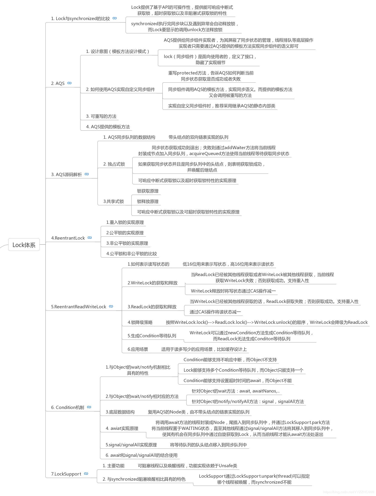

# Lock体系

在 Lock 接口出现之前， Java 中的应用程序对于多线程的并发安全处理只能基于synchronized 关键字来解决。但是 synchronized 在有些场景中会存在一些短板，也就是它并不适合于所有的并发场景。 但是在 Java5 以后， Lock 的出现可以解决synchronized 在某些场景中的短板，它比 synchronized 更加灵活。

## Lock 的实现

Lock 本质上是一个接口，它定义了释放锁和获得锁的抽象方法， 定义成接口就意味着它定义了锁的一个标准规范，也同时意味着锁的不同实现。 实现 Lock 接口的类有很多，以下为几个常见的锁实现；

## ReentrantLock：

表示重入锁，它是唯一一个实现了 Lock 接口的类。重入锁指的是线程在获得锁之后，再次获取该锁不需要阻塞，而是直接关联一次计数器增加重入次数

## ReentrantReadWriteLock：

重入读写锁，它实现了 ReadWriteLock 接口，在这个类中维护了两个锁，一个是 ReadLock，一个是 WriteLock，他们都分别实现了 Lock接口。读写锁是一种适合读多写少的场景下解决线程安全问题的工具，基本原则是： 读和读不互斥、读和写互斥、写和写互斥。也就是说涉及到影响数据变化的操作都会存在互斥。

## Condition机制

Condition 是一个多线程协调通信的工具类，可以让某些线程一起等待某个条件（condition），只有满足条件时，线程才会被唤醒；

## StampedLock：

stampedLock 是 JDK8 引入的新的锁机制，可以简单认为是读写锁的一个改进版本，读写锁虽然通过分离读和写的功能使得读和读之间可以完全并发，但是读和写是有冲突的，如果大量的读线程存在，可能会引起写线程的饥饿。stampedLock 是一种乐观的读策略，使得乐观锁完全不会阻塞写线程
