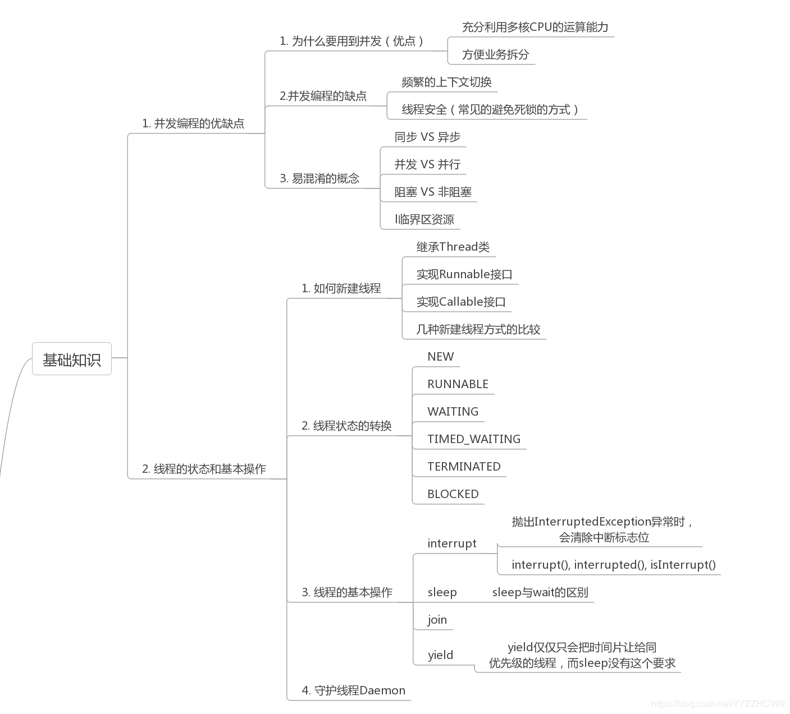

# 并发基础

## 多线程发展历史
- 一个指令在一个cpu上运行，用户输入一个指令，cpu处理完毕之后返回结果。
- 批处理操作，将多个指令集中写入到磁带上，一次交给CPU处理，返回结果。
- 批处理操作不能解决串行化等待的问题，如果一个线程（读写磁盘）指令执行时间比较长，后面的指令需要一直等待，CPU资源也处于阻塞态得不到充分利用。
- 多线程技术通过线程切换可以实现多个线程同时执行，从而在一定程度上提升性能和cpu的利用率。
- 多线程最终解决的是“等待”的问题
## 多线程应用场景
- 需要通过并行结算来提高程序执行性能。
- 需要等待网络，IO响应导致耗费大量的执行时间，采用异步线程方式来减少阻塞。
## 线程状态

## 并发关键字

## 并发容器

## 线程池

## 原子类和并发工具

## CPU 的高速缓存（一二三级缓存）

**L1一级缓存**：
L1d（32k）: 一级数据缓存，L1i（32k）:一级指令缓存。访问需要1ns

**L2（1M）二级缓存**：
每个cpu内核内部的缓存，各个内核之间不共享, 访问需要3ns

**L3（6M）三级缓存**：
多个cup内核共享三级缓存。访问耗时12ns.

## 缓存一致性问题
多核cpu情况下存在指令重排，而各个cpu核心之间的数据不共享而导致的缓存一致性问题。方案：

**最初的方案**：总线锁
当一个cpu core对其缓存操作的时候往总线发送一个lock信号，cpu core的处理请求将会被阻塞，这样的串行化操作实质上违背了多核cpu存在的意义，所以p6以后的处理器采用的新的方式： 缓存锁, 不锁总线，只锁缓存。
缓存锁：读写操作时候生成一个lock前缀指令，一个cpu core的缓存回写到内存会导致其他cpu core的缓存无效。

**实现方式**：MESI协议
在cpu缓存中保留一个标记位，有四种状态。
M：(Modified) 修改缓存，当前 CPU 缓存已经被修改，表示已经和内存中的数据不一致了
E(Exclusive) 独占缓存，当前 cpu 的缓存和内存中数据保持一直，而且其他
处理器没有缓存该数据
S(Shared) 共享缓存，数据和内存中数据一致，并且该数据存在多个 cpu
缓存中
I(Invalid) 失效缓存，说明 CPU 的缓存已经不能使用了

每个cpu core 不仅知道自己的读写操作，也监听其他cache的读写操作，成为嗅探协议。 （snooping协议）
cpu的读取遵循几个原则：

- 如果缓存的状态是 I，那么就从内存中读取，否则直接从缓存读取
- 如果缓存处于 M 或者 E 的 CPU 嗅探到其他 CPU 有读的操作，就把自己的缓存写入到内存，并把自己的状态设置为 S
- 只有缓存状态是 M 或 E 的时候， CPU 才可以修改缓存中的数据，修改后，缓存状态变为 M

## 线程安全性问题
原子性问题：
cpu乱序执行引入指令集不能保证原子性
可见性问题
多个cpu内核的高速缓存互相不共享，引发导致缓存不一致问题
有序性
指令重排不能保证指令的有序执行。
## JMM内存模型
jmm内存模型定义了共享内存系统中多线程读写操作的规范，来屏蔽各种硬件和操作系统的内存访问差异，使其达到在java各个平台都可以一致的内存访问效果。
