# java compile class

## 引言

众所周知，Java语言有一个很重要的特点是平台无关性，即用Java语言编写的程序可以在不同平台之间无缝迁移，Java对这个特性有一个著名的宣传口号：“一次编写，到处运行（Write Once，Run AnyWhere）”。Java能够实现平台无关性的原因是它在平台之上提供了一个Java运行环境，也就是JVM，Sun公司以及其他虚拟机提供商发布了许多可以运行在各种不同平台上的虚拟机，这些虚拟机都可以载入和执行同一种平台无关的字节码文件——Class文件。

## Class文件详解

### 概述

Class文件是一组以8位字节为基础单位的二进制流，各个数据项目严格按照顺序紧凑地排列在Class文件之中，中间没有添加任何分隔符。根据Java虚拟机规范的规定，Class文件结构采用一种类似于C语言结构体的伪结构来存储数据，这种伪结构只有两种数据类型：无符号数和表。

- 无符号数属于基本的数据类型，以u1、u2、u4、u8来表示1个字节、2个字节、4个字节和8个字节的无符号数，无符号数可以用来描述数字、索引引用、数量值或者按照UTF-8编码构成的字符串值。
- 表是由多个无符号数或者其他表作为数据项构成的符合数据类型，所有表都习惯性地以“_info”结尾。表用于描述有层次关系的复合结构的数据，整个Class文件本质上就是一张表，它由下表所示的数据项构成。

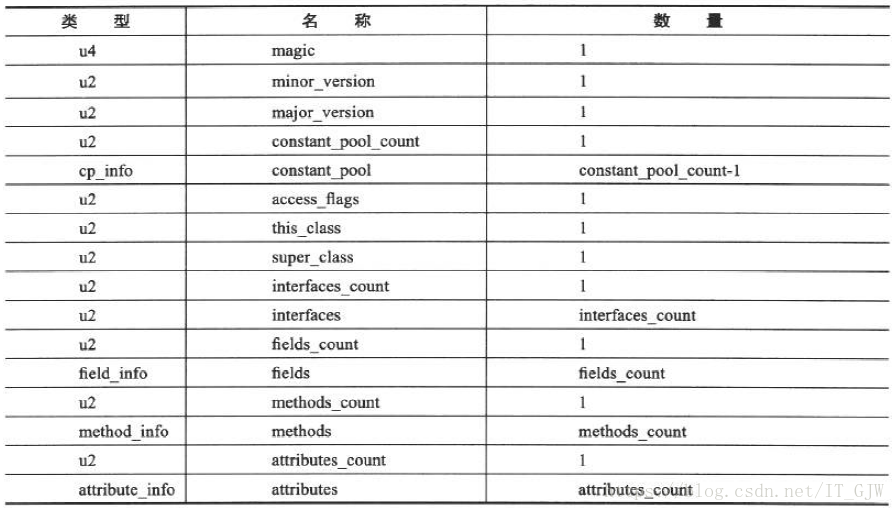  

下面将依次介绍上表中各个数据项的具体含义。

### 魔数与Class文件的版本

每个Class文件的头四个字节称为魔数（Magic Number），它的唯一作用是确定这个文件是否为一个能被虚拟机接收的Class文件。很多文件存储标准中都使用魔术来进行身份识别，譬如图片格式，如gir或者jpeg等在文件头中都存在魔数。文件格式的制定者可以自由地选择魔数值，只要这个值还没有被广泛采用过同时又不会引起混淆即可。Class文件的魔数富有“浪漫气息”，值为0xCAFEBABE（咖啡宝贝？）。预示着Java语言的logo。

紧跟着魔数的四个字节存储的是Class文件的版本号：第5和第6个字节是次版本号（Minor Version）,第7和第8个字节是主版本号（Major Version）。JDK的版本越高，它生成的Class文件的版本号就越高，高版本的JDK能向下兼容以前版本的Class文件，但不能运行以后版本的Class文件，即使文件格式未发生任何变化，JDK也必须拒绝执行。

下表列出了从JDK1.1到JDK1.7，主流JDK版本编译器输出的默认和可支持的Class文件版本号。  

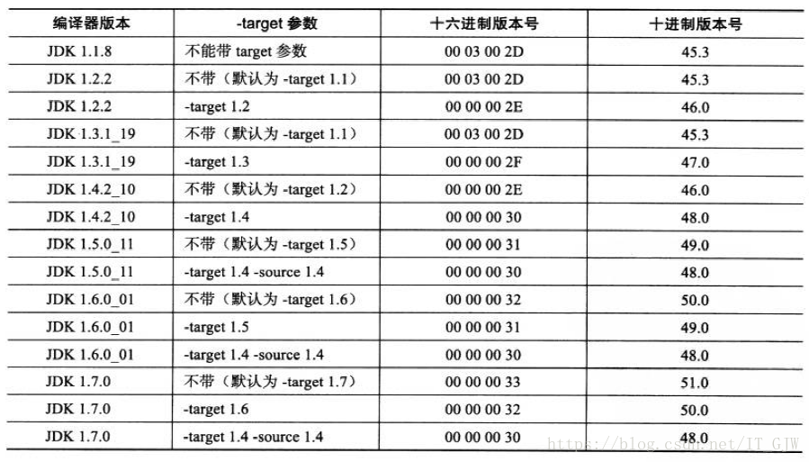  

### 常量池（constant_pool）

紧接着版本号之后的是常量池入口，常量池可以理解为Class文件之中的资源仓库，它是Class文件结构中与其他项目关联最多的数据项，也是占用Class文件空间最大的数据项目之一。

由于常量池中的常量数量不固定，所以在常量池的入口需要放置一项u2类型的数据，代表容量池容量计数值（constant_pool_count），这个容量计数从1而不是0开始。

常量池中主要存放两大类常量：字面量（Literal）和符号引用（Symbolic Reference）。字面量比较接近Java语言层面的常量概念，如文本字符串、声明为final的常量值等。而符号引用则属于编译原理方面的概念，包括下面三类常量：

- 类和接口的全限定名
- 字段的名称和描述符
- 方法的名称和描述符  

Java代码在进行Javac编译时，并不像C和C++那样有“连接”的步骤，而是在虚拟机加载Class文件的时候进行动态连接。也就是说，在Class文件中不会保存各个方法、字段的最终内存布局信息，当虚拟机运行时，需要从常量池获得对应的符号引用，再在类创建时或运行时解析、翻译到具体的内存地址之中。

JDK1.7中，总共有14种类型的常量，每种常量都是表类型的数据项。这14种表都有一个共同的特点，就是表开始的第一位是一个u1类型的标志位，代表当前常量属于哪种常量类型。这14种常量类型代表的具体含义见下表

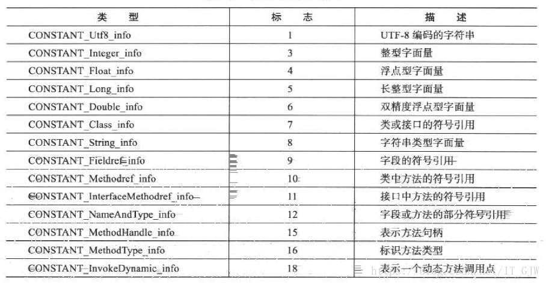 

之所以说常量池是最烦琐的数据，是因为这14中常量类型各自均有自己的结构。

我们将一段简单Java程序使用JDK1.7编译后的Class文件为例进行说明
```
public class TestClass{
	private int m;
	public int inc(){
		return m + 1;
	}
}
```
用十六进制视图打开class文件

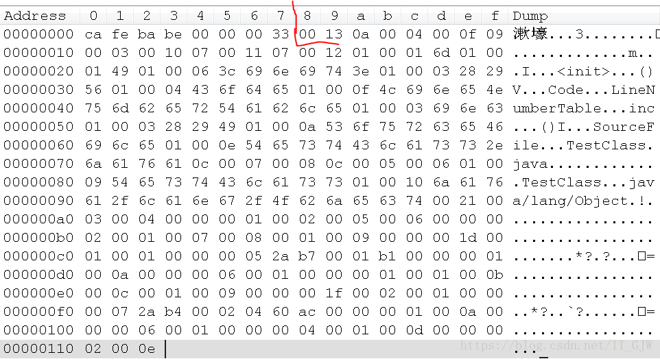  

可以看到前8个字节是该class文件的魔数和版本号，紧接着的一个十六进制数0x0013，即十进制的19，这就代表z这个class文件的常量池中有18项常量，索引值为1~18。然后就是第一个常量了，上面说过，每种类型的常量开始的第一位都是一个u1类型的标志位，代表该常量的类型，这里是0x0a，十进制的10，查上面的表可知是CONSTANT_Methodref_info，说明这个常量是类中方法的符号应用。接下来我们看下该类型常量的具体结构

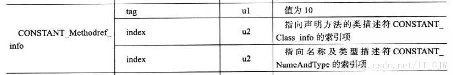  

tag是标志位，上面已经说过，index是索引值，它指向常量池中其他常量。这里的第一个index值为0x0004，即指向常量池中的第4个常量，第二个index是0x000f，即指向常量池中的第15个常量。我们可以用javap -verbose命令查看class文件的字节码内容。  

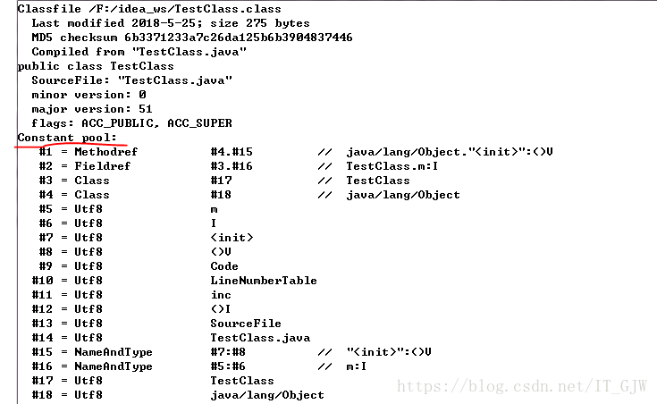 

可以看到和我们分析的一致，该class文件中确实有18项常量，从#1到#18，第一项常量是MethodRef类型的常量，也就是CONSTANT_Methodref_info类型。该常量中有两个index值，第一个index指向常量池中的第4个常量，可以看到第4个常量是Class类型（即CONSTANT_Class_info）。而CONSTANT_Class_info类型的常量结构如下

 

它包含一个index，这个index也是指向常量池中的其他常量，从上图可以看到这里指向的是第18个常量，第18个常量的类型是utf8（即CONSTANT_Utf8_info），CONSTANT_Utf8_info类型的常量结构如下  

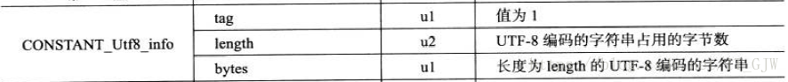 

该常量存储的是UTF-8编码的字符串，从图中可以看到，这里的字符串值为“java/lang/Object”。至此，我们终于翻译出了该class文件中第一个常量的第一个index代表的真正内容。用同样的方法可以找到第二个index代表的真正内容，这样第一个常量要表示的内容就浮出水面了。其实就是图中斜杠后面的内容。

这里只介绍了14种常量类型中的几种，其他的常量类型与这几种大同小异，就不再一一介绍了。

### 访问标志（access_flags）

常量池结束之后，紧接着的两个字节代表访问标志，这个标志用于识别一些类或者接口层次的访问信息，包括：这个Class是接口还是类；是否被定义为public类型；是否定义为abstract类型；如果是类的话，是否被声明为final等。

### 类索引(this_class)、父类索引(super_class)与接口索引集合(interfaces)

类索引、父类索引和接口索引集合都按顺序排列代访问标志之后，类索引用于确定这个类的全限定名，父类索引用于确定这个类的父类的全限定名。由于Java语言不允许多继承，因此父类索引只有一个，除了java.lang.Object之外，所有的Java类都有父类，因此除了Object外，所有Java类的父类索引都不为0。

类索引和父类索引均是u2类型的数据，它们各自指向一个类型为CONSTANT_Class_info类型的常量，通过CONSTANT_Class_info类型的常量中的索引值可以找到定义在CONSTATN_Utf8_info类型的常量中的全限定名字符串。该查找过程可用下图表示

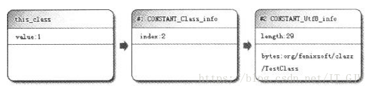 

接口索引集合用来描述这个类实现了哪些接口，它是一组u2类型的数据的集合，集合中的第一项是接口计数器，表示索引表的容量。如果一个类没有实现任何接口，则该计数器值为0。 

### 字段表集合(fields)

字段表用于描述接口或者类中声明的变量。字段包括类级变量和实例级变量，但不包括方法内部声明的局部变量。Java中描述一个字段可以包括的信息有：字段的作用域（public、protectded、private修饰符）、实例变量还是类变量（static修饰符）、可变性（final）、并发可见性（volatile）、可否序列化（transient）、字段的数据类型、字段名称。上述这些信息中，各个修饰符都是布尔值，有么有某个修饰符，要么没有，很适合用标志位表示。而字段名称，字段类型，这些信息无法固定，只能引用常量池中的常量描述。因此，可以得到如下的字段表结构  

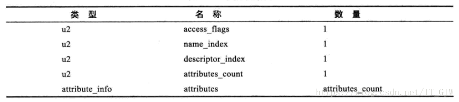 

access_flags代表字段修饰符，name_index和descriptor_index都是对常量池的引用，分表代表字段的简单名称和字段的描述符。字段的简单名称是指没有类型的字段名称，而字段描述符则是用来描述字段的数据类型。根据描述符规则，基本数据类型以及void类型（修饰方法返回值，后面会介绍）都用一个大写字符表示，而对象类型用字符L加对象的全限定名来表示。详见下表

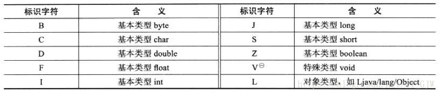 

对于数组类型，每一维度将使用一个前置的“[”字符描述，如一个定义为java.lang.String[][]类型的二维数组，将被记录为“[[Ljava/lang/String;”,一个整型数组将被记录为“[I"。

紧跟在descriptor_index之后的是一个属性表集合，字段都可以在属性表中描述零至多项的额外信息。attribute_count代表属性表计数器，如果字段没有额外信息，那么其值为0。如果其值不为0，则attribute_count后面会紧跟着attribute_count个attribute数据项。

字段表集合中不会列出从超类或者父接口中继承而来的字段，但有可能列出Java代码中不存在的字段，譬如在内部类中为了保持对外部类的访问性，会自动添加指向外部类的实例字段。  

### 方法表集合(methods)

见名知意，方法表用来描述类或接口中的方法。它的结构和字段表一致，依次包括了访问标志（access_flag）、名称索引（name_index）、描述符索引（descriptor_index）、属性表集合（attributes）几项，见下表。

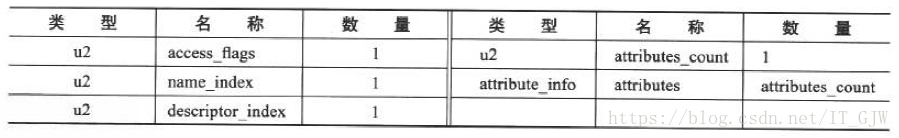 

需要注意的是与字段描述符不同，方法描述符需要描述方法的参数列表和返回值，按照先参数列表后返回值的顺序描述，参数列表按照参数的严格顺序放在一组小括号“（）”之内。返回值的描述规则与描述字段的数据类型一样。举个例子，方法void inc()的描述符为“（）V”，方法java.lang.String toString()的描述符为“（）Ljava/lang/String;”，方法int indexOf(char[] source, int sourceOffset, int sourceCount, char[] target, int targetOffset, int targetCount, int fromIndex)的描述符为“（[CII[CIII）I”。

至此，方法的定义已经通过访问标志，名称索引，描述符索引表达清楚了，但是方法里的代码去哪了？这就要轮到属性表集合登场了。方法里的Java代码经过编译器编译成字节码指令后，存放在方法属性表集合中一个名为“Code”的属性表中。属性表作为class文件格式中最具有扩展性的一种数据项目，将在随后介绍。

与字段表集合相对应的，子类的方法表集合中不会出现继承自父类的方法信息，但同样的，有可能出现编译器自动添加的方法，最典型的便是类构造器“<clinit>”方法和实例构造器“<init>”方法。  

### 属性表集合(attributes)

属性表（attribute_info）在前面的讲解中已经出现过多次了，字段表、方法表都可以携带自己的属性表集合，以用于描述某些场景专有的信息。

与Class文件中其他的数据项目要求严格的顺序、长度和内容不同，属性表集合的限制稍微宽松了一些，不再要求各个属性表具有严格的顺序。为了能够正确解析Class文件，《Java虚拟机规范（Java SE 7）》中，预定义了21项属性表。下文将对一些常用的属性表进行讲解。  

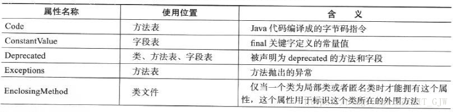 

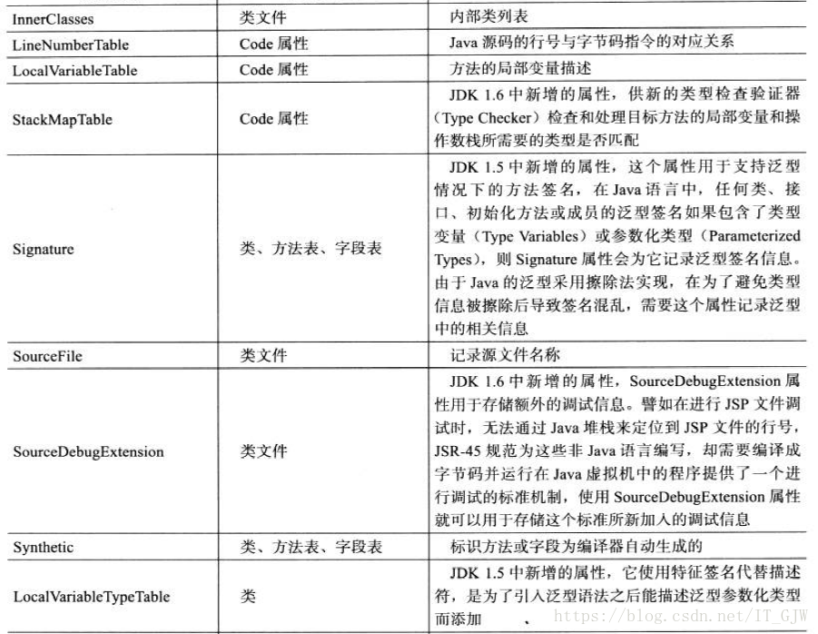  

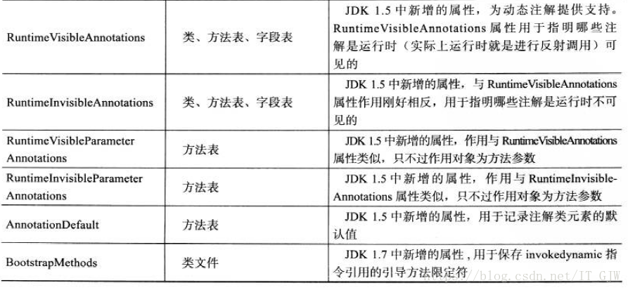  

对于每个属性表，它的名称需要从常量池中引用给一个CONSTANT_Utf8_info类型的常量来表示，而属性值的结构则时完全自定义的，值需要通过一个u4的长度属性说明属性值所占用的位数即可。一个符合规则的属性表应该满足下表所定义的结构  

  
 
**Code属性**
 
Code属性存储编译后的字节码指令，它出现在方法表的属性集合中，但并非所有方法都必须存在这个属性，譬如抽象方法就不存在Code属性。Code属性的结构如下表所示  

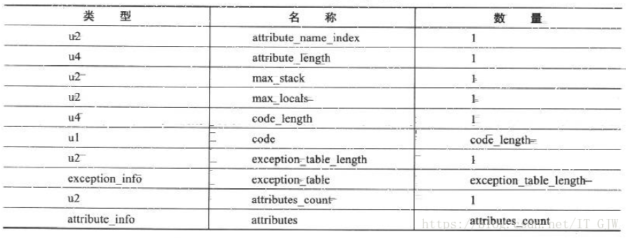   

attribute_name_index是一项指向CONSTANT_Utf8_info型常量的索引，其值固定为“Code”，代表该属性的属性名称，attribute_length指示了属性值的长度。

max_stack代表了操作数栈（Operand Stacks）深度的最大值。在方法执行的任意时刻，操作数栈都不会超过这个深度。虚拟机运行时需要根据这个值来分配栈帧中操作栈深度。

max_locals代表了局部变量表所需的存储空间，它的单位是Slot，Slot是虚拟机为局部变量分配内存所使用的最小单位。对于byte、char、float、int、short、boolean和returnAddress等长度不超过32的数据类型，每个局部变量占用一个Slot，而double和long这两种64位的数据类型需要两个Slot来存放。

code_length和code用来存储字节码指令，cond_length代表字节码长度，code是用于存储字节码指令的一系列字节流。既然叫字节码指令，那么每个指令就是一个u1类型的单字节，当虚拟机读到code中的一个字节码时，就可以找出这个字节码代表的是什么指令，并且可以知道这条指令后面是否需要紧随参数，以及参数应当如何理解。u1类型的取值范围是0x00~0xFF，对应十进制的0 ~ 255，也就是一共可以表达256条指令，目前Java虚拟机规范已经定义了200条编码值对应的指令含义，编码与指令之间的对应关系可以查阅“虚拟机字节码指令表”。感兴趣的读者可自行上网百度该表，这里就不贴了。

Code属性是class文件中最重要的一个属性，如果把一个Java程序中的信息分为代码（方法体里面的Java代码）和元数据（Metadata，包括类、字段、方法定义及其他信息）两部分，那么在整个class文件中，Code属性用于描述代码，所有的其他数据项都用于描述元数据。

我们同样可以使用javap -verbose命令查看一个class文件中方法的Code属性，我们仍以上面那段Java代码为例，查看结果如下图

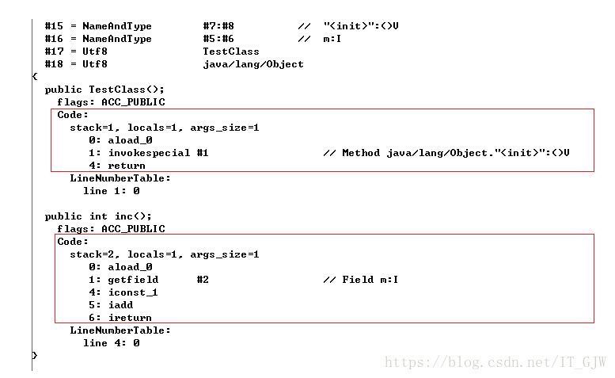 

可以看到这个class文件中有两个方法，一个是编译器自动添加的实例构造方法，另一个是我们写的方法，红色矩形框内的是方法的Code属性内容。这里需要注意的是args_size，它代表方法的参数个数，奇怪的是无论是实例构造方法还是我们自己写的inc方法，它们都是无参的啊，args_size怎么会是1呢？这就和this关键字有关了，我们知道，在类的任何实例方法中，都可以通过this关键字访问到方法所属的对象，之所以可以这样使用，是因为Javac编译器在编译的时候把对this关键字的访问转变成对一个普通方法参数的访问，然后在虚拟机调用实例方法时自动传入此参数，所以这两个方法的args_size均为1,。与此同时，实例方法的局部变量表中至少会存在一个指向当前对象实例的局部变量，所以locals的值也是1。如果把inc方法声明为static，那么args_size就不会等于1，而是0了。

在字节码指令之后的是这个方法的显式异常处理表（下文简称异常表）集合，异常表的格式如下表所示

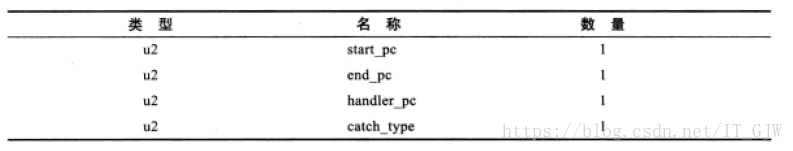 

它包含4个字段，这些字段的含义为：如果当字节码在第start_pc行到end_pc行出现了类型为catch_type或者其子类的异常（catch_type为指向一个CONSTANT_Class_info型常量的索引），则转到handler_pc行继续处理。

异常表实际上是Java代码的一部分，编译器使用异常表而不是简单的跳转命令来实现Java异常及finally处理机制。下面这段代码演示了字节码层面中的try-catch-finally是如何实现的。

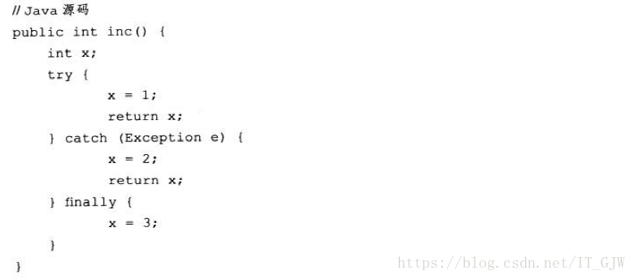  
 

这段代码的执行结果是：如果没有出现异常，返回值是1,；如果出现了Exception异常，返回值是2；如果出现了Exception以外的异常，方法非正常退出，没有返回值。我们一起来分析下字节码的执行过程，从字节码层面看为何会有这样的返回结果。

字节码从0~4行所做的操作是将整数1赋值给变量x，并且将此时x的值赋值一份副本到最后一个本地变量表的Slot中，这个Slot里面的值在ireturn指令执行前将会被重新读到操作栈顶，作为方法返回值使用。为了讲解方便，我们将这个Slot称为returnValue，如果此时没有异常，则继续执行5~9行，将变量赋值为3，然后将之前保存字returnValue中的整数1读入栈顶，用ireturn指令将该值返回，方法结束。如果出现了异常，PC寄存器指针转到第10行，第10 ~20行所做的的操作是将2赋值给x，然后将此时的x值赋给returnValue，在将变量x的值改为3，最后将returnValue中的值读入栈顶并返回，方法结束。从第21行开始的代码，作用是x的值设置成3，并将栈顶的异常抛出，方法结束。

Exception属性

   这里的Exception属性是在方法表中与Code属性平级的一项属性，不要与前面的异常表产生混淆。Exception属性的作用是列举方法中可能抛出的受查（Checked Exception），也就是方法描述时在throws关键字后面列举的异常。

LineNumberTable属性

   该属性用于描述Java源码行号与字节码行号（字节码的偏移量）之间的对应关系。它并不是运行时必需的属性，但默认会生成到class文件中，可以在Javac中使用-g:none或-g:lines选项来取消或要求生成这项信息。如果选择不生成LineNumberTable属性，对程序运行产生的最主要影响就是当抛出异常时，堆栈中不会显示出错的行号，并且在调试程序时，也无法按照源码来设置断点。

LocalVariableTable属性

   该属性用于描述栈帧中局部变量表中的变量与Java源码中定义的变量之间的关系，它也不是运行时必需的属性，但默认会生产在class文件中，如果没有这项属性，最大的影响是当其他人引用这个方法时，所有的参数名称都会丢失，IDE将会用诸如args0、arg1之类的占位符代替原有的参数名。

SourceFile属性

   该属性用于记录生成这个class文件的源码名称。

ConstantValue属性

   该属性的作用是通知虚拟机自动为静态变量赋值。只有被static关键字修饰的变量（类变量）才可以使用这项属性。类似“int x = 3”和“static int x =3”这样的变量定义在Java程序中是非常常见的，但虚拟机对这两种变量赋值的方式和时刻有所不同。对于非static类型的变量（即实例变量）的赋值是在实例构造器<init>方法中进行的；而对于类变量，则有两种方式可以选择：在类构造器<clinit>方法中或者使用ConstantValue属性。目前Sun Javac编译器的做法是：如果同时使用final和static来修饰一个变量（按照习惯：称为“常量”更贴切），并且这个变量的数据类型是基本类型或者java.lang.String的话，就生成ConstantValue属性来初始化，如果这个变量没有被final修饰，或者并非基本类型及字符串，则将会在<clinit>方法中进行初始化。

InnerClasses属性

   该属性用于记录内部类与宿主类之间的关联。如果一个类中定义了内部类，那编译器将会为它及它包含的内部类生成InnerClasses属性。

Deprecated及Synthetic属性

   Deprecated属性用于表示某个类、字段或者方法已经被程序作者定义为不再推荐使用，它可以通过在代码中使用@deprecated注解进行设置。

   Synthetic属性代表此字段或者方法并不是由Java源码直接产生的，而是编译器自行添加的。

StackMapTable属性

   StackMapTable属性在JDK1.6发布后增加到了class文件规范中，它是一个复杂的变长属性，位于Code属性表中，这个属性会在虚拟机类加载的字节码验证阶段被新类型检查验证器使用，目的在于代替以前比较消耗性能的基于数据流分析的类型推导验证器。

Signature属性

   该属性在JDK1.5发布后增加到class文件规范之中，它是一个可选的定长属性，可以出现于类、属性表和方法表结构的属性表中。它是用来记录泛型类型信息的，由于Java语言的泛型采用的是擦除法实现的伪泛型，在字节码（Code属性）中，泛型信息编译之后都通通被擦除掉。使用擦除法的好处是实现简单，在运行前也能节省一些类型所占的内存空间。但坏处就是无法像C#等有真泛型支持的语言那样，将泛型类型与用于定义的普通类型同等对待，例如运行期做反射时无法获得泛型信息。Signature属性就是为了弥补这个缺陷，现在Java的反射API能够获取泛型类型，最终的数据来源就是这个属性。

BootstrapMethods属性

   该属性在JDK1.7发布后增加到class文件规范之中，它是一个复杂的变长属性，类文件的属性表中。这个属性用于保存invokedynamic引用的引导方法限定符。

结语

   其他类型的属性表就不再一一介绍了，感兴趣的读者可以自行查找资料学习，至此我们就把一个class文件的结构详细介绍了一遍，class文件是Java虚拟机执行引擎的数据入口，也是Java技术体系的基础支柱之一。了解class文件结构对进一步了解Java虚拟机执行引擎有很重要的意义。


