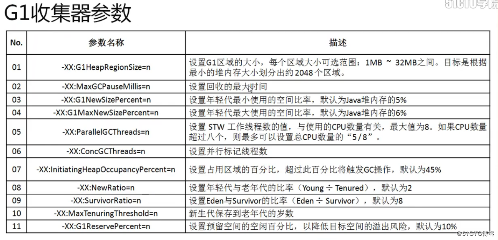

# java的GC深入讲解

前两篇讲解的java的编译和运行能系统化的了解了java的编译运行机制，下面来整理一下运行过程中的GC，也就是垃圾回收。  

在描述GC之前先说一下JDK8的内存变化

在JDK1.8之前永久代的内存大小是计算在JVM分配中的。

  

从JDK1.8以及以后的版本，永久代被替换为元空间，分离出了JVM分配的空间，直接使用宿主机内存。

  

## java对象创建的流程

为了说清楚GC的作用，先描述一下java在编写的时候对象创建的过程影响堆的那些空间以及怎么触发GC

  

1. 大多数内存对象要么生存周期比较短，很快就会没人引用，比如处理RPC请求的buffer可能只会生存几微秒；
2. 么生存周期比较长，比如Block Cache中的热点Block，可能就会生存几分钟，甚至更长时间。
3. 基于这样的事实，JVM将整个堆内存分为两个部分：新生代（young generation）和老生代（tenured generation），除此之外，JVM还有一个非堆内存区－Perm区，主要存放class信息以及其他meta元信息，
4. 其中Young区又分为Eden区和两个Survivor 区：S0和S1。
5. 一个内存对象在创建之后，首先会为其在新生代申请一块内存空间，如果这个对象在新生代存活了很长时间，会将其迁移到老生代。
6. 在大多数对延迟敏感的业务场景下（比如HBase），建议使用如下JVM参数，-XX:+UseParNewGC和XX:+UseConcMarkSweepGC，其中前者表示对新生代执行并行的垃圾回收机制，而后者表示对老生代执行并行标记－清除垃圾回收机制。
7. 可见，JVM允许针对不同内存区执行不同的GC策略。
```
//在 cdh中默认是这样设置的
-XX:+UseParNewGC -XX:+UseConcMarkSweepGC -XX:CMSInitiatingOccupancyFraction=70 -XX:+CMSParallelRemarkEnabled
```

## GC的算法

### 标记-清除算法

最基础的算法，分标记和清除两个阶段：首先标记处所需要回收的对象，在标记完成后统一回收所有被标记的对象。

它有两点不足：一个效率问题，标记和清除过程都效率不高；一个是空间问题，标记清除之后会产生大量不连续的内存碎片（类似于我们电脑的磁盘碎片），空间碎片太多导致需要分配大对象时无法找到足够的连续内存而不得不提前触发另一次垃圾回收动作。

 

### 复制算法

为了解决效率问题，出现了“复制”算法，他将可用内存按容量划分为大小相等的两块，每次只需要使用其中一块。当一块内存用完了，将还存活的对象复制到另一块上面，然后再把刚刚用完的内存空间一次清理掉。这样就解决了内存碎片问题，但是代价就是可以用内容就缩小为原来的一半。

 
 
### 标记-整理算法

复制算法在对象存活率较高时就会进行频繁的复制操作，效率将降低。因此又有了标记-整理算法，标记过程同标记-清除算法，但是在后续步骤不是直接对对象进行清理，而是让所有存活的对象都向一侧移动，然后直接清理掉端边界以外的内存。


## 垃圾收集器

垃圾收集算法是方法论，垃圾收集器是具体实现。JVM规范对于垃圾收集器的应该如何实现没有任何规定，因此不同的厂商、不同版本的虚拟机所提供的垃圾收集器差别较大，这里只看HotSpot虚拟机。

JDK7/8后，HotSpot虚拟机所有收集器及组合（连线）如下：  


### Serial收集器

Serial收集器是最基本、历史最久的收集器，曾是新生代手机的唯一选择。他是单线程的，只会使用一个CPU或一条收集线程去完成垃圾收集工作，并且它在收集的时候，必须暂停其他所有的工作线程，直到它结束，即“Stop the World”。停掉所有的用户线程，对很多应用来说难以接受。比如你在做一件事情，被别人强制停掉，你心里奔腾而过的“羊驼”还数的过来吗？

尽管如此，它仍然是虚拟机运行在client模式下的默认新生代收集器：简单而高效（与其他收集器的单个线程相比，因为没有线程切换的开销等）。

**工作示意图**


### ParNew收集器

ParNew收集器是Serial收集器的多线程版本，除了使用了多线程之外，其他的行为（收集算法、stop the world、对象分配规则、回收策略等）同Serial收集器一样。

是许多运行在Server模式下的JVM中首选的新生代收集器，其中一个很重还要的原因就是除了Serial之外，只有他能和老年代的CMS收集器配合工作。

**工作示意图**

  

### Parallel Scavenge收集器

新生代收集器，并行的多线程收集器。它的目标是达到一个可控的吞吐量（就是CPU运行用户代码的时间与CPU总消耗时间的比值，即 吞吐量=行用户代码的时间/[行用户代码的时间+垃圾收集时间]），这样可以高效率的利用CPU时间，尽快完成程序的运算任务，适合在后台运算而不需要太多交互的任务。

### Serial Old收集器

Serial 收集器的老年代版本，单线程，“标记整理”算法，主要是给Client模式下的虚拟机使用。

另外还可以在Server模式下：

JDK 1.5之前的版本中雨Parallel Scavenge 收集器搭配使用

可以作为CMS的后背方案，在CMS发生Concurrent Mode Failure是使用

**工作示意图**


### Parallel Old收集器

Parallel Scavenge的老年代版本，多线程，“标记整理”算法，JDK 1.6才出现。在此之前Parallel Scavenge只能同Serial Old搭配使用，由于Serial Old的性能较差导致Parallel Scavenge的优势发挥不出来，尴了个尬~~

Parallel Old收集器的出现，使“吞吐量优先”收集器终于有了名副其实的组合。在吞吐量和CPU敏感的场合，都可以使用Parallel Scavenge/Parallel Old组合

**工作示意图**


### CMS收集器

CMS(Concurrent Mark Sweep)收集器是一种以获取最短回收停顿时间为目标的收集器，停顿时间短，用户体验就好。

基于“标记清除”算法，并发收集、低停顿，运作过程复杂，分4步：

1)初始标记：仅仅标记GC Roots能直接关联到的对象，速度快，但是需要“Stop The World”

2)并发标记：就是进行追踪引用链的过程，可以和用户线程并发执行。

3)重新标记：修正并发标记阶段因用户线程继续运行而导致标记发生变化的那部分对象的标记记录，比初始标记时间长但远比并发标记时间短，需要“Stop The World”

4)并发清除：清除标记为可以回收对象，可以和用户线程并发执行

由于整个过程耗时最长的并发标记和并发清除都可以和用户线程一起工作，所以总体上来看，CMS收集器的内存回收过程和用户线程是并发执行的。

**工作示意图**

  

**CSM收集器有3个缺点：**

**1)对CPU资源非常敏感**并发收集虽然不会暂停用户线程，但因为占用一部分CPU资源，还是会导致应用程序变慢，总吞吐量降低。

CMS的默认收集线程数量是=(CPU数量+3)/4；当CPU数量多于4个，收集线程占用的CPU资源多于25%，对用户程序影响可能较大；不足4个时，影响更大，可能无法接受。

**2)无法处理浮动垃圾**（在并发清除时，用户线程新产生的垃圾叫浮动垃圾）,可能出现"Concurrent Mode Failure"失败。

并发清除时需要预留一定的内存空间，不能像其他收集器在老年代几乎填满再进行收集；如果CMS预留内存空间无法满足程序需要，就会出现一次"Concurrent Mode Failure"失败；这时JVM启用后备预案：临时启用Serail Old收集器，而导致另一次Full GC的产生；

**3)产生大量内存碎片** CMS基于"标记-清除"算法，清除后不进行压缩操作产生大量不连续的内存碎片，这样会导致分配大内存对象时，无法找到足够的连续内存，从而需要提前触发另一次Full GC动作。

### G1收集器

G1（Garbage-First）是JDK7-u4才正式推出商用的收集器。G1是面向服务端应用的垃圾收集器。它的使命是未来可以替换掉CMS收集器。

**G1收集器特性**：

**并行与并发**：能充分利用多CPU、多核环境的硬件优势，缩短停顿时间；能和用户线程并发执行。

**分代收集**：G1可以不需要其他GC收集器的配合就能独立管理整个堆，采用不同的方式处理新生对象和已经存活一段时间的对象。

**空间整合**：整体上看采用标记整理算法，局部看采用复制算法（两个Region之间），不会有内存碎片，不会因为大对象找不到足够的连续空间而提前触发GC，这点优于CMS收集器。

**可预测的停顿**：除了追求低停顿还能建立可以预测的停顿时间模型，能让使用者明确指定在一个长度为M毫秒的时间片段内，消耗在垃圾收集上的时间不超N毫秒，这点优于CMS收集器。

**为什么能做到可预测的停顿？**

是因为可以有计划的避免在整个Java堆中进行全区域的垃圾收集。

G1收集器将内存分大小相等的独立区域（Region），新生代和老年代概念保留，但是已经不再物理隔离。

G1跟踪各个Region获得其收集价值大小，在后台维护一个优先列表；

每次根据允许的收集时间，优先回收价值最大的Region（名称Garbage-First的由来）；

这就保证了在有限的时间内可以获取尽可能高的收集效率。

**对象被其他Region的对象引用了怎么办？**
```
判断对象存活时，是否需要扫描整个Java堆才能保证准确？在其他的分代收集器，也存在这样的问题（而G1更突出）：新生代回收的时候不得不扫描老年代？无论G1还是其他分代收集器，JVM都是使用Remembered Set来避免全局扫描：每个Region都有一个对应的Remembered Set；每次Reference类型数据写操作时，都会产生一个Write Barrier 暂时中断操作；然后检查将要写入的引用指向的对象是否和该Reference类型数据在不同的 Region（其他收集器：检查老年代对象是否引用了新生代对象）；如果不同，通过CardTable把相关引用信息记录到引用指向对象的所在Region对应的Remembered Set中；

进行垃圾收集时，在GC根节点的枚举范围加入 Remembered Set ，就可以保证不进行全局扫描，也不会有遗漏。
```

不计算维护Remembered Set的操作，回收过程可以分为4个步骤（与CMS较为相似）：

1)初始标记：仅仅标记GC Roots能直接关联到的对象，并修改TAMS(Next Top at Mark Start)的值，让下一阶段用户程序并发运行时能在正确可用的Region中创建新对象，需要“Stop The World”

2)并发标记：从GC Roots开始进行可达性分析，找出存活对象，耗时长，可与用户线程并发执行

3)最终标记：修正并发标记阶段因用户线程继续运行而导致标记发生变化的那部分对象的标记记录。并发标记时虚拟机将对象变化记录在线程Remember Set Logs里面，最终标记阶段将Remember Set Logs整合到Remember Set中，比初始标记时间长但远比并发标记时间短，需要“Stop The World”

4)筛选回收：首先对各个Region的回收价值和成本进行排序，然后根据用户期望的GC停顿时间来定制回收计划，最后按计划回收一些价值高的Region中垃圾对象。回收时采用复制算法，从一个或多个Region复制存活对象到堆上的另一个空的Region，并且在此过程中压缩和释放内存；可以并发进行，降低停顿时间，并增加吞吐量。

**工作示意图**

  

## 提高偏

### 年轻代高效分配内存

在实际运行中，由于Eden区总保存大量的新生对象，所以hotspot虚拟机为了加快内存的分配，使用了Bump-The-Pointer和TLAB(Thread-Local-Allocation-Buffers)两种优化

  

  

### 老年代标记-压缩算法

因为老年代CMS收集器会产生大量的碎片，为了优化这个问题对收集完的内存进行压缩。

  


## GC 小结

**可用的GC的方式**
* 新生代
> 串行GC（Serial Coping）
> 并行回收GC（Parallel Scavenge）
> 并行GC(ParNew)
* 老年代
> 串行GC（Serial MSC）
> 并行GC（Parallel MSC）
> 并发GC(CMC)

年轻代串行GC（copy）  

  

年轻代并行回收GC  

  

年轻代并行GC  

  

老年代串行GC  

  

老年代并行GC  

  

常用gc策略：

  

GC调整策略：

 

收集器参数设置

 

 

