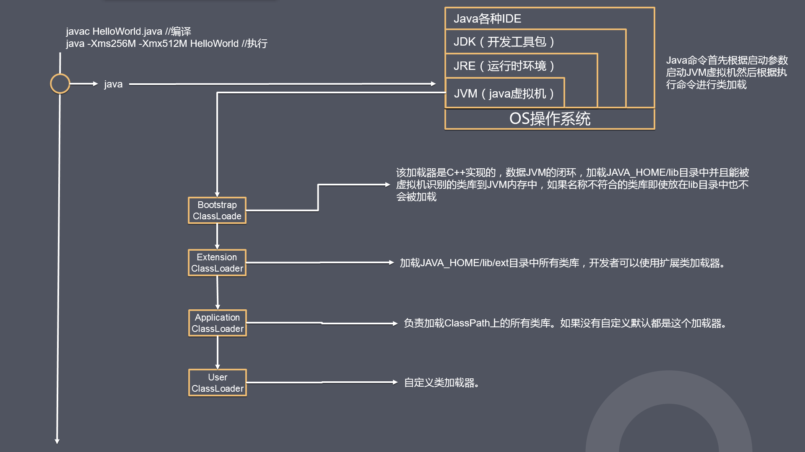
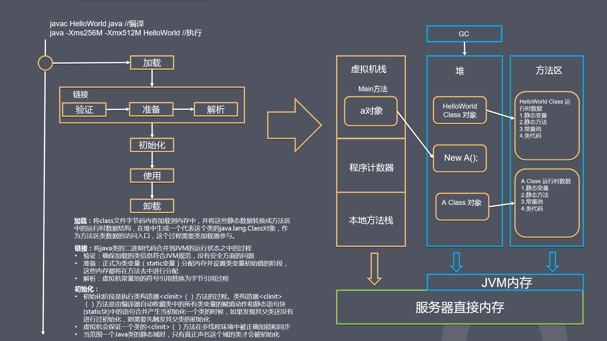
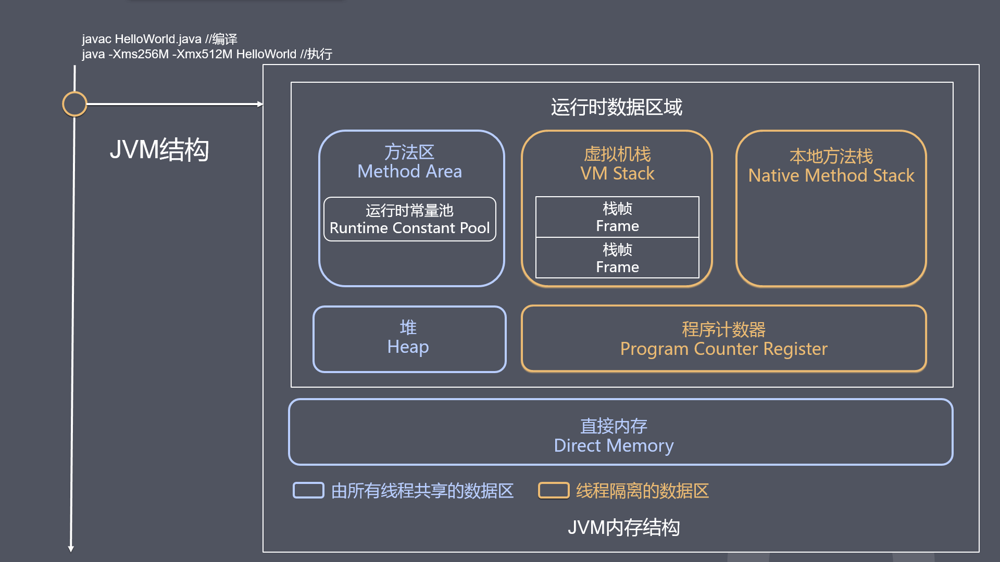
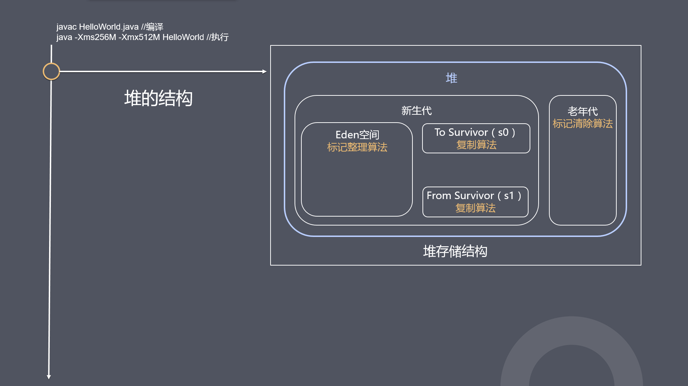

# java程序的运行来理解JVM

## 编译运行

```
javac HelloWorld.java //编译
java -Xms256M -Xmx512M HelloWorld //执行
```
每一个程序都会进行编译和运行，在编译的过程中会把java文件编译成class文件，等待JVM加载运行。  

这里有几点注意的问题需要根据下面的运行流程明确一下  

- 虚拟机栈为什么叫栈，这个线程栈主要的用途就是进栈出栈运算执行，所以最容易导致溢出的就是**递归**执行，<-Xss>这个参数控制栈的大小，这个直接分配的事宿主机的内存

- 堆是java的对象内存，这里还会存储class对象（叫句柄比较合适）的引用指向的事方法区存储的class信息，<-Xmx -Xms>这两个参数设置最大和最小内存，GC的都是在这个区域进行。

- 方法区这个是永久代，存储这加载class后的所有信息和常量，而GC就是回收无引用的常量和无用的类

- class加载连接的过程只会给出默认值，不会进行初始化，就算声明了初始值，也是在初始化过程中完成。

  

  

  

  

