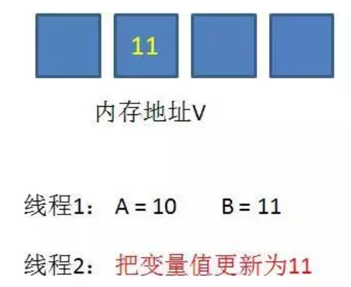

# 什么是CAS机制
CAS是英文单词compare and swap的缩写，翻译过来就是比较并替换。
一个CPU原子指令，在硬件层面实现的机制，体现了乐观锁的思想。
# 原理
CAS机制当中使用了3个基本操作数：内存地址V，旧的预期值A，要修改的新值B。
# 原理图
### 1.在内存地址V当中，存储着值为10的变量。  

### 2.此时线程1想要把变量的值增加1。对线程1来说，旧的预期值A=10，要修改的新值B=11。

### 3.在线程1要提交更新之前，另一个线程2抢先一步，把内存地址V中的变量值率先更新成了11。

### 4.线程1开始提交更新，首先进行A和地址V的实际值比较（Compare），发现A不等于V的实际值，提交失败。

### 5.线程1重新获取内存地址V的当前值，并重新计算想要修改的新值。此时对线程1来说，A=11，B=12。这个重新尝试的过程被称为自旋。

### 6.这一次比较幸运，没有其他线程改变地址V的值。线程1进行Compare，发现A和地址V的实际值是相等的。

### 7.线程1进行SWAP，把地址V的值替换为B，也就是12。

# 代码测试
```
//线程增强修改flag
public class AtomicBooleanTest implements Runnable{

    private static AtomicBoolean flag = new AtomicBoolean(true);

    public static void main(String[] args) {
        AtomicBooleanTest ast = new AtomicBooleanTest();
        Thread thread1 = new Thread(ast);
        Thread thread = new Thread(ast);
        thread1.start();
        thread.start();
    }
    @Override
    public void run() {
        System.out.println("thread:"+Thread.currentThread().getName()+";flag:"+flag.get());
        if (flag.compareAndSet(true,false)){
            System.out.println(Thread.currentThread().getName()+""+flag.get());
            try {
                Thread.sleep(5000);
            } catch (InterruptedException e) {
                e.printStackTrace();
            }
            flag.set(true);
        }else{
            System.out.println("重试机制thread:"+Thread.currentThread().getName()+";flag:"+flag.get());
            try {
                Thread.sleep(500);
            } catch (InterruptedException e) {
                e.printStackTrace();
            }
            run();
        }

    }

}
```
执行结果
```
thread:Thread-1;flag:true
thread:Thread-0;flag:true
Thread-1false
重试机制thread:Thread-0;flag:false
thread:Thread-0;flag:false
重试机制thread:Thread-0;flag:false
thread:Thread-0;flag:false
重试机制thread:Thread-0;flag:false
thread:Thread-0;flag:false
重试机制thread:Thread-0;flag:false
thread:Thread-0;flag:false
重试机制thread:Thread-0;flag:false
thread:Thread-0;flag:false
重试机制thread:Thread-0;flag:false
thread:Thread-0;flag:false
重试机制thread:Thread-0;flag:false
thread:Thread-0;flag:false
重试机制thread:Thread-0;flag:false
thread:Thread-0;flag:false
重试机制thread:Thread-0;flag:false
thread:Thread-0;flag:false
重试机制thread:Thread-0;flag:false
thread:Thread-0;flag:true
Thread-0false
```
# CAS的优缺点
## 优点
性能要比Synchronized好很多
## 缺点
再有冲突的时候，CPU的开销很大，代码层面不能保证原子性，要在开发中自己考虑。