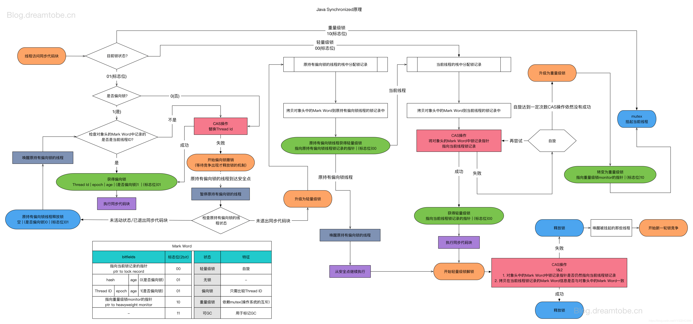
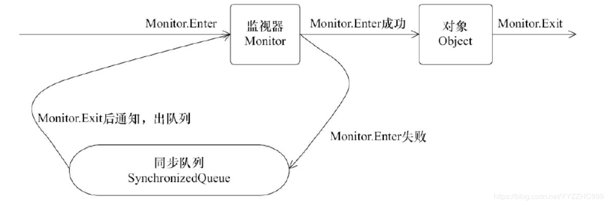

# synchronized原理 (偏向锁，轻量级锁，重量级锁膨胀过程)

## Monitor对象
什么是Monitor？可以理解为一个同步工具，也可以描述为一个同步机制。所以java对象天生是一个Monitor, 每个Object对象里面markOop --> monitor() 里可以保存ObjectMonitor对象。

## Synchronized 锁升级和获取过程
synchronized的锁是进行过优化的，引入了偏向锁、轻量级锁；锁的级别从低到高逐步升级， 无锁->偏向锁->轻量级锁->重量级锁

## 自旋锁（CAS）
自旋锁就是让不满足条件的线程等待一段时间，而不是立即挂起。看持有锁的线程是否能够很快释放锁。怎么自旋呢？其实就是一段没有任何意义的循环。
虽然它通过占用处理器的时间来避免线程切换带来的开销，但是如果持有锁的线程不能在很快释放锁，那么自旋的线程就会浪费处理器的资源，因为它不会做任何有意义的工作。所以，自旋等待的时间或者次数是有一个限度的，如果自旋超过了定义的时间仍然没有获取到锁，则该线程应该被挂起

## 偏向锁
大多数情况下，锁不仅不存在多线程竞争，而且总是由同一线程多次获得，为了让线程获得锁的代价更低而引入了偏向锁。当一个线程访问同步块并获取锁时，会在对象头和栈帧中的锁记录里存储锁偏向的线程ID，以后该线程在进入和退出同步块时不需要进行CAS操作来加锁和解锁，只需简单地测试一下对象头的Mark Word里是否存储着指向当前线程的偏向锁。如果测试成功，表示线程已经获得了锁。如果测试失败，则需要再测试一下Mark Word中偏向锁的标识是否设置成1（表示当前是偏向锁）：如果没有设置，则使用CAS竞争锁；如果设置了，则尝试使用CAS将对象头的偏向锁指向当前线程

## 轻量级锁
引入轻量级锁的主要目的是在多没有多线程竞争的前提下，减少传统的重量级锁使用操作系统互斥量产生的性能消耗。当关闭偏向锁功能或者多个线程竞争偏向锁导致偏向锁升级为轻量级锁，则会尝试获取轻量级锁

## 重量级锁
重量级锁通过对象内部的监视器（monitor）实现，其中monitor的本质是依赖于底层操作系统的Mutex Lock实
现，操作系统实现线程之间的切换需要从用户态到内核态的切换，切换成本非常高。前面我们在讲Java对象头的时候，讲到了monitor这个对象，在hotspot虚拟机中，通过ObjectMonitor类来实现monitor。他的锁的获取过程的体现会简单很多.

