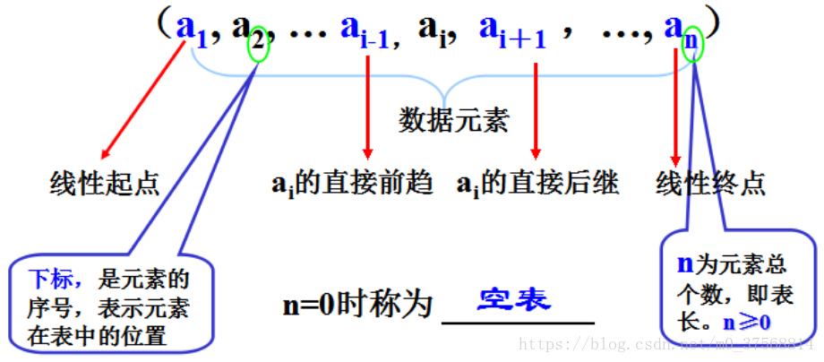
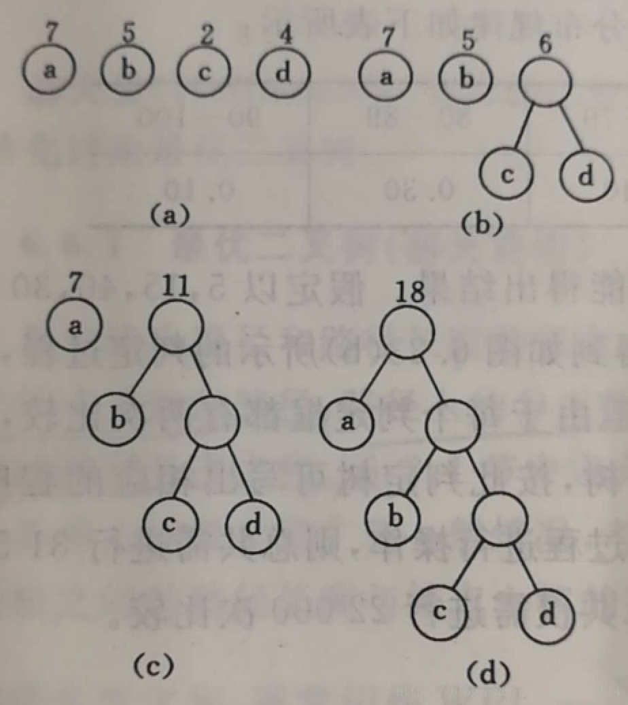

# 数据结构的概念

## 第一章：绪论

1.数据结构：是一门研究非数值计算的程序设计问题中计算机的操作对象以及他们之间的关系和操作等的学科。

2.数据结构涵盖的内容：


3.基本概念和术语:

数据：对客观事物的符号表示，在计算机科学中是指所有能输入到计算机中并被计算机程序处理的符号的总称。

数据元素：数据的基本单位，在计算机程序中通常作为一个整体进行考虑和处理。

数据对象：性质相同的数据元素的集合，是数据的一个子集。

数据结构：相互之间存在一种或多种特定关系的数据元素的集合。

数据类型：一个值的集合和定义在这个值集上的一组操作的总称。

4.算法和算法分析

1）算法是对特定问题求解步骤的一种描述，它是指令的有限序列，其中每一条指令表示一个或多个操作。

算法五个特性：有穷性，确定性，可行性，输入，输出。

2）算法设计要求：正确性，可读性，健壮性，效率与低存储量需求。

3）算法分析：时间复杂度，空间复杂度，稳定性

## 第二章：线性表

1.线性结构特点：在数据元素的非空有限集合中，(1)存在唯一的一个被称做“第一个”的数据元素；(2)存在唯一的一个被称做“最后一个”的数据元素；(3)除第一个之外，集合中的每个数据元素均只有一个前驱；(4)除最后一个之外，集合中每个数据元素均只有一个后继。

2.线性表定义：有限个性质相同的数据元素组成的序列。



3.线性表的存储结构：顺序存储结构和链式存储结构

**顺序存储定义**：把逻辑上相邻的数据元素存储在物理上相邻的存储单元中的存储结构。

通常用数组来描述数据结构中的顺序存储结构。

**链式存储结构**: 其结点在存储器中的位置是随意的，即逻辑上相邻的数据元素在物理上不一定相邻。通过指针来实现。

数据结构的基本运算：修改、插入、删除、查找、排序

4.线性表的顺序表示和实现

1）修改：通过数组的下标便可访问某个特定元素并修改。

时间复杂度O(1)

2） 插入:在线性表的第i个位置前插入一个元素
```
实现步骤：

   ①将第n至第i 位的元素逐一向后移动一个位置；

   ②将要插入的元素写到第i个位置；

   ③表长加1。

   注意：事先应判断: 插入位置i 是否合法?表是否已满?

   应当符合条件： 1≤i≤n+1  或  i=[1, n+1]

   核心语句：

for (j=n; j>=i; j--)

a[j+1]=a[ j ]; 

a[ i ]=x;   

n++;

  插入时的平均移动次数为：n(n+1)/2÷（n+1）＝n/2≈O(n)
```

3）删除：删除线性表的第i个位置上的元素

```
  实现步骤：

  ①将第i+1 至第n 位的元素向前移动一个位置；

  ②表长减1。

  注意：事先需要判断，删除位置i 是否合法?

  应当符合条件：1≤i≤n  或  i=[1, n]

  核心语句：

{

    for ( j=i+1; j<=n; j++ )

    a[j-1]=a[j]; 

    n--;

}

  顺序表删除一元素的时间效率为:T(n)=(n-1)/2 ≈O(n)

  顺序表插入、删除算法的平均空间复杂度为O(1)

```

5.线性表的链式表示和实现

线性链表：用一组任意的存储单元存储线性表的数据元素（这组存储单元可以是连续的，也可以是不连续的）。

一个数据元素称为一个结点，包括两个域：存储数据元素信息的域称为数据域；存储直接后继存储位置的域称为指针域。指针域中存储的信息称作指针或链。

由于链表的每个结点中只包含一个指针域，故线性链表又称为单链表。

1）单链表的修改(或读取）

思路：要修改第i个数据元素，必须从头指针起一直找到该结点的指针p，return p;  

然后才能：p->data=new_value

2）单链表的插入


```
链表插入的核心语句：

Step 1：s->next=p->next;

Step 2：p->next=s;
```

3）单链表的删除


```
删除动作的核心语句（要借助辅助指针变量q）：

q = p->next;           //首先保存b的指针，靠它才能找到c；

p->next=q->next;  //将a、c两结点相连，淘汰b结点；

free(q) ;             //彻底释放b结点空间
```

4）双向链表的插入操作


```
设p已指向第i 元素，请在第 i 元素前插入元素 x：

① ai-1的后继从 ai ( 指针是p)变为 x（指针是s) :

                s->next = p  ;   p->prior->next = s ;

② ai  的前驱从ai-1 ( 指针是p->prior)变为 x ( 指针是s);

                s->prior = p ->prior ; p->prior = s ;
```

5）双向链表的删除操作


```
设p指向第i 个元素，删除第 i 个 元素

后继方向：ai-1的后继由ai ( 指针p)变为ai+1(指针 p ->next );

                   p ->prior->next =  p->next  ;

前驱方向：ai+1的前驱由ai ( 指针p)变为ai-1 (指针 p -> prior );

                 p->next->prior = p ->prior ;
```

6.循环链表

循环链表是另一种形式的链式存储结构。它的特点是表中最后一个结点的指针域指向头结点，整个链表形成一个环。

循环链表的操作和线性链表基本一致，差别仅在于算法中的循环条件不是p或p->next是否为空，而是它们是否等于头指针。

## 第三章：栈和队列

1.栈:限定仅在表尾进行插入或删除操作的线性表。

栈的基本操作：在栈顶进行插入或删除，栈的初始化、判空及取栈顶元素等。

入栈口诀：堆栈指针top “先压后加”

出栈口诀：堆栈指针top “先减后弹”

top=0表示空栈。

栈的应用:数制转换，括号匹配的检验，行编辑程序，迷宫求解，表达式求值，递归实现。

2.队列：是一种先进先出的线性表，它只允许在表的一端进行插入，而在另一端删除元素。

允许插入的一端叫做队尾，允许删除的一端叫做队头。

除了栈和队列外，还有一种限定性数据结构是双端队列。双端队列是限定插入和删除操作在表的两端进行的线性表。

链队列


序列队列


## 第四章：串

1.串是数据元素为字符的线性表，串的定义及操作。

串即字符串，是由零个或多个字符组成的有限序列，是数据元素为单个字符的特殊线性表。

2.串的存储结构，因串是数据元素为字符的线性表，所以存在“结点大小”的问题。

串有三种机内表示方法：


总结：


## 第五章：数组和广义表

这个章节暂不介绍

重点：二维数组的位置计算。

矩阵的压缩存储：特殊矩阵(三角矩阵，对称矩阵)，稀疏矩阵

## 第六章：树和二叉树

1.树：是n(n≥0)个结点的有限集。(1)有且仅有一个特定的称为根（root）的结点;（2）当n>1时，其余的结点分为m(m≥0)个互不相交的有限集合T1,T2，…，Tm。每个集合本身又是棵树，被称作这个根的子树 。

2.二叉树：是n（n≥0）个结点的有限集合，由一个根结点以及两棵互不相交的、分别称为左子树和右子树的二叉树组成。

二叉树的性质，存储结构。

性质1: 在二叉树的第i层上至多有2^(i-1)个结点（i>0）。

性质2: 深度为k的二叉树至多有2^k-1个结点（k>0）。

性质3: 对于任何一棵二叉树，如果其终端结点数为n0,度为2的结点数有n2个，则叶子数n0=n2＋1

性质4: 具有n个结点的完全二叉树的深度必为 [log2n]+1

性质5: 对完全二叉树，若从上至下、从左至右编号，则编号为i 的结点，其左孩子编号必为2i，其右孩子编号为2i＋1；其双亲的编号必为i/2（i＝1 时为根,除外）。

二叉树的存储结构：

1).顺序存储结构

按二叉树的结点“自上而下、从左至右”编号，用一组连续的存储单元存储。

若是完全/满二叉树则可以做到唯一复原。

不是完全二叉树：一律转为完全二叉树！

方法很简单，将各层空缺处统统补上“虚结点”，其内容为空。

缺点：①浪费空间；②插入、删除不便 

2).链式存储结构

用二叉链表即可方便表示。一般从根结点开始存储。

| lchild | data | rchild |
| ------ | ---- | ------ |

优点：①不浪费空间；②插入、删除方便

3.二叉树的遍历。

指按照某种次序访问二叉树的所有结点，并且每个结点仅访问一次，得到一个线性序列。

遍历规则:二叉树由根、左子树、右子树构成，定义为D、 L、R

若限定先左后右，则有三种实现方案：

| DLR | LDR | LRD |
| ------ | ---- | ------ |
| 先序遍历 | 中序遍历 | 后序遍历 |

4.线索二叉树

1）线索二叉树可以加快查找前驱与后继结点，实质就是将二叉链表中的空指针改为指向前驱或后继的线索，线索化就是在遍历中修改空指针。

通常规定：对某一结点，若无左子树，将lchild指向前驱结点；若无右子树，将rchild指向后继结点。

还需要设置左右两个tag，用来标记当前结点是否有子树。

若ltag==1,lchild指向结点前驱；若rtag==1，rchild指向结点后继。

2）线索二叉树的存储结构如下：


5.树和森林

1）树有三种常用存储方式：

①双亲表示法     ②孩子表示法    ③孩子—兄弟表示法

2）森林、树、二叉树的转换

(1)将树转换为二叉树

树中每个结点最多只有一个最左边的孩子(长子)和一个右邻的兄弟。按照这种关系很自然地就能将树转换成相应的二叉树：a.在所有兄弟结点之间加一连线

b.对每个结点，除了保留与其长子的连线外，去掉该结点与其它孩子的连线。


(2)将一个森林转换为二叉树：

具体方法是：a.将森林中的每棵树变为二叉树；

b.因为转换所得的二叉树的根结点的右子树均为空，故可将各二叉树的根结点视为兄弟从左至右连在一起，就形成了一棵二叉树。


(3)二叉树转换为树

是树转换为二叉树的逆过程。

a.加线。若某结点X的左孩子结点存在，则将这个左孩子的右孩子结点、右孩子的右孩子结点、右孩子的右孩子的右孩子结点，都作为结点X的孩子。将结点X与这些右孩子结点用线连接起来。

b.去线。删除原二叉树中所有结点与其右孩子结点的连线。


(4)二叉树转换为森林：

假如一棵二叉树的根节点有右孩子，则这棵二叉树能够转换为森林，否则将转换为一棵树。

a.从根节点开始，若右孩子存在，则把与右孩子结点的连线删除。再查看分离后的二叉树，若其根节点的右孩子存在，则连线删除。直到所有这些根节点与右孩子的连线都删除为止。

b.将每棵分离后的二叉树转换为树。


6.树和森林的遍历

树的遍历

① 先根遍历：访问根结点；依次先根遍历根结点的每棵子树。

② 后根遍历：依次后根遍历根结点的每棵子树；访问根结点。

森林的遍历

① 先序遍历

若森林为空，返回；

访问森林中第一棵树的根结点；

先根遍历第一棵树的根结点的子树森林；

先根遍历除去第一棵树之后剩余的树构成的森林。

② 中序遍历

若森林为空，返回；

中根遍历森林中第一棵树的根结点的子树森林；

访问第一棵树的根结点；

中根遍历除去第一棵树之后剩余的树构成的森林。

7.哈夫曼树及其应用

Huffman树：最优二叉树（带权路径长度最短的树）

Huffman编码：不等长编码。

树的带权路径长度：(树中所有叶子结点的带权路径长度之和)

构造Huffman树的基本思想：权值大的结点用短路径，权值小的结点用长路径。

构造Huffman树的步骤（即Huffman算法）：

(1) 由给定的 n 个权值{ w1, w2, …, wn }构成n棵二叉树的集合F = { T1, T2, …, Tn } （即森林） ，其中每棵二叉树 Ti 中只有一个带权为 wi 的根结点，其左右子树均空。

(2) 在F 中选取两棵根结点权值最小的树 做为左右子树构造一棵新的二叉树，且让新二叉树根结点的权值等于其左右子树的根结点权值之和。

(3) 在F 中删去这两棵树，同时将新得到的二叉树加入 F中。

(4) 重复(2) 和(3) , 直到 F 只含一棵树为止。这棵树便是Huffman树。

具体操作步骤：


应用：用于通信编码

在通信及数据传输中多采用二进制编码。为了使电文尽可能的缩短，可以对电文中每个字符出现的次数进行统计。设法让出现次数多的字符的二进制码短些，而让那些很少出现的字符的二进制码长一些。假设有一段电文，其中用到 4 个不同字符Ａ，Ｃ，Ｓ，Ｔ，它们在电文中出现的次数分别为 7 ， 2 ， 4 ， 5 。把 7 ， 2 ， 4 ， 5 当做 4 个叶子的权值构造哈夫曼树如图(a) 所示。在树中令所有左分支取编码为 0 ，令所有右分支取编码为1。将从根结点起到某个叶子结点路径上的各左、右分支的编码顺序排列，就得这个叶子结点所代表的字符的二进制编码，如图(b) 所示。这些编码拼成的电文不会混淆，因为每个字符的编码均不是其他编码的前缀，这种编码称做前缀编码。



## 第七章 图

### 1.图的定义，概念、术语及基本操作

**1）图的定义**

图(Graph)是由顶点的有穷非空集合和顶点之间边的集合组成;

通常表示为:G(V,E),G表示一个图，V是图G中顶点的集合，E是图G中边的集合；

注意：在图中数据元素称之为顶点(Vertex),而且顶点集合有穷非空；在图中任意两个顶点之间都可能有关系，顶点之间的逻辑关系用边来表示。

**2）图的分类**

按照有无方向，分为无向图和有向图；

**无向图**：如果图中任意两个顶点之间的边都是无向边，则称该图为无向图。

无向边：若顶点M到顶点N的边没有方向，称这条边为无向边，用无序偶对(M,N)或(N,M)表示。

无向图是有边和顶点构成。如下图所示就是一个无向图G1：


无向图G1= (V1,{E1}),其中顶点集合 V1={A,B,C,D};边集合E1={(A,B),(B,C),(C,D),(D,A)}

**无向完全图**：在无向图中，如果任意两个顶点之间都存在边，则称该图为无向完全图。

含有n个顶点的无向完全图有n * (n-1)/2条边。下面是一个无向完全图


4个顶点，6条无向边，每个顶点对应3条边 ，一共4个顶点 总共 4*3，每个顶点对应的边都重复计算了一次，所以整体要除以2。

对于n各 顶点和e条边的无向图满足：0<=e <= n(n-1)/2


**有向图**：如果图中任意两个顶点之间的边都是有向边，则称该图为有向图。

有向边：若顶点M到顶点N的边有方向，称这条边为有向边，也称为弧，用偶序对 < M, N >表示；M表示弧尾，N表示弧头

有向图是有弧和顶点构成，如下图所示是一个有向图G2：


有向图G2=(V2，{E2}),其中顶点集合 V2={A,B,C,D};弧集合E2={< A,D>,< B,A>,< C,A>,< B,C>}

对于弧<A,D>来说， A是弧尾，D是弧头

注意：无向边用 小括号 “()”表示，有向边用“<>”表示。

**有向完全图**：在有向图中，如果任意两个顶点之间都存在方向互为相反的两条弧，则称该图为有向完全图。

含有n个顶点的无向完全图有n * (n-1)条边。下面是一个有向完全图


4个顶点，12条弧，一共4个顶点 总共 4*3。

2，按照弧或边的多少，分为稀疏图和稠密图；

若边或弧的个数e<=NlogN(N是顶点的个数)，称为系数图，否则称为稠密图；

3，按照边或弧是否带权，其中带权的图统称为网

有些图的边或弧具有与它相关的数字，这种与图的边或弧相关的数叫做权。

有向网中弧带权的图叫做有向网；

无向网中边带权的图叫做无向网；

比如下图就是一个无向图


**3）图的顶点和边间关系**

**邻接点 度 入度 出度**

对于无向图，假若顶点v和顶点w之间存在一条边，则称顶点v和顶点w互为邻接点，边(v,w)和顶点v和w相关联。

顶点v的度是和v相关联的边的数目，记为TD(v);


上面这个无向图G1，A和B互为邻接点，A和D互为邻接点，B和C互为邻接点，C和D互为邻接点;

A的度是2,B的度是2,C的度是2,D的度是2;所有顶点度的和为8，而边的数目是4；

**图中边的数目e = 各个顶点度数和的一半。**

对于有向图来说，与某个顶点相关联的弧的数目称为度(TD)；以某个顶点v为弧尾的弧的数目定义为顶点v的出度(OD)；以顶点v为弧头的弧的数目定义为顶点的入度(ID)

度(TD) = 出度(OD) + 入度(ID);


比如上面有向图，

A的度为3 ，A的入度 2，A的出度是1

B的度为2 ，B的入度 0，B的出度是2

C的度为2 ，C的入度 1，C的出度是1

D的度为1 ，D的入度 1，D的出度是0

所有顶点的入度和是4，出度和也是4，而这个图有4个弧

所以 有向图的弧 e = 所有顶点入度的和 = 所有顶点出度的和

**路径 路径长度 简单路径 回路 (环) 简单回路(简单环)**

设图G=(V，{E})中的一个顶点序列{u=Fi0,Fi1,Fi2,….Fim=w}中，(Fi,j-1,Fi,j)∈E 1 ≤j ≤m,则称从顶点u到顶点w之间存在一条**路径**，路径上边或弧的数目称作**路径长度**，

若路径中的顶点不重复出现的路径称为**简单路径**

若路径中第一个顶点到最后一个顶点相同的路径称为**回路或环**

若路径中第一个顶点和最后一个顶点之外，其余顶点不重复出现的回路，称为**简单回路或简单环**

比如下图 ：


从B 到 D 中顶点没有重复出现 ，所以是简单路径 ，边的数目是2，所以路径长度为 2。


图1和图2都是一个回路(环),图1中出了第一个顶点和最后一个顶点相同之外，其余顶点不相同，所以是简单环(简单回路)，图2，有与顶点C重复就不是一个简单环了；

**4）连通图概念**

**连通图**

在无向图G(V,{E})中，如果从顶点V到顶点W有路径，则称V和W是连通的。如果对于图中任意两个顶点Vi、Vj∈V,Vi和Vj都是连通的，则称G是连通图。

如下图所示：


图1，顶点A到顶点E就无法连通，所以图1不是连通；图2，图3，图4属于连通图；

**连通分量**

若无向图为非连通图，则图中各个极大连通子图称作此图的连通分量；

图1是无向非连通图，由两个连通分量，分别是图2和图3。图4尽管也是图1的子图，但是它不满足极大连通，也就说极大连通应当是包含ABCD四个顶点，比如图2那样；

**强连通图**

在有向图G(V,{E})中，如果对于每一对Vi ,Vj∈V,Vi≠Vj,从Vi到Vj和从Vj到Vi都存在有向路径,则称G是强连通图。


图1不是强连通图因为D到A不存在路径，图2属于强连通图。

**强连通分量**

若有向图不是强连通图，则图中各个极大强连通子图称作此图的强连通分量；


图1不是强连通图，但是图2是图1的强连通子图，也就是强连通分量；

**5）生成树和生成森林**

**生成树**

假设一个连通图有n个顶点和e条边，其中n-1条边和n个顶点构成一个极小连通子图，称该极小连通子图为此连通图的生成树；


图1是一个连通图含有4个顶点和4条边，图2，图3，图4含有3条边和4个顶点，构成了一个极小连通图子图，也称为生成树，为什么是极小连通子图，因为图2，图3，图4中少一条边都构不成一个连通图，多一条边就变成一个回路(环)，所以是3条边和4个顶点构成的极小连通子图。图5尽管也是3个边4个顶点，但不是连通图。

**生成森林**

如果一个有向图恰有一个顶点的入度为0，其余顶点的入度为1，则是一颗**有向树**；

入度为0，相当于根节点，入度为1，相当于分支节点；，比如下面的有向图就是一个有向树


顶点B的入度是0，其余顶点的入度是1；

一个有向图的生成森林由若干颗有向树组成，含有图中全部顶点，但有足以构成若干颗不相交的有向树的弧；


有向图1去掉一些弧后分解成2颗有向树，图2和图3，这两颗树就是有向图图1的生成森林；

### 2.图的存储结构

1).邻接矩阵(数组)表示法

① 建立一个顶点表和一个邻接矩阵

② 设图 A = (V, E) 有 n 个顶点，则图的邻接矩阵是一个二维数组 A.Edge[n][n]。

注：在有向图的邻接矩阵中，

   第i行含义：以结点vi为尾的弧(即出度边）；

   第i列含义：以结点vi为头的弧(即入度边）。

邻接矩阵法优点：容易实现图的操作，如：求某顶点的度、判断顶点之间是否有边（弧）、找顶点的邻接点等等。

邻接矩阵法缺点：n个顶点需要n*n个单元存储边(弧);空间效率为O(n^2)。


2).邻接表(链式)表示法

① 对每个顶点vi 建立一个单链表，把与vi有关联的边的信息（即度或出度边）链接起来，表中每个结点都设为3个域:


② 每个单链表还应当附设一个头结点（设为2个域），存vi信息；

③ 每个单链表的头结点另外用顺序存储结构存储。

邻接表的优点：空间效率高；容易寻找顶点的邻接点；

邻接表的缺点：判断两顶点间是否有边或弧，需搜索两结点对应的单链表，没有邻接矩阵方便。

### 3.图的遍历

遍历定义：从已给的连通图中某一顶点出发，沿着一些边，访遍图中所有的顶点，且使每个顶点仅被访问一次，就叫做图的遍历，它是图的基本运算。

图的遍历算法求解图的连通性问题、拓扑排序和求关键路径等算法的基础。

**图常用的遍历：一、深度优先搜索；二、广度优先搜索**

**深度优先搜索（遍历）步骤**：

① 访问起始点 v;

② 若v的第1个邻接点没访问过，深度遍历此邻接点；

③ 若当前邻接点已访问过，再找v的第2个邻接点重新遍历。

基本思想：——仿树的先序遍历过程。

遍历结果：v1->v2->v4->v8->v5-v3->v6->v7

**广度优先搜索（遍历）步骤**：

① 在访问了起始点v之后，依次访问 v的邻接点；

② 然后再依次（顺序）访问这些点（下一层）中未被访问过的邻接点；

③ 直到所有顶点都被访问过为止。


遍历结果：v1->v2->v3->v4->v5-v6->v7->v8

### 4.图的连通性问题

1）对无向图进行遍历时，对于连通图，仅需从图中任一顶点出发，进行深度优先搜索或广度优先搜索，便可访问到图中所有顶点。

2）最小生成树:在连通网的所有生成树中，所有边的代价和最小的生成树。

构造最小生成树有很多算法，但是他们都是利用了最小生成树的同一种性质：MST性质（假设N=(V,{E})是一个连通网，U是顶点集V的一个非空子集，如果（u，v）是一条具有最小权值的边，其中u属于U，v属于V-U，则必定存在一颗包含边（u，v）的最小生成树），下面就介绍两种使用MST性质生成最小生成树的算法：普里姆算法和克鲁斯卡尔算法。

Kruskal算法特点：将边归并，适于求稀疏网的最小生成树。

Prime算法特点: 将顶点归并，与边数无关，适于稠密网。

**Prime算法构造最小生成树过程如下图**：


**Kruskal算法构造最小生成树过程如下图**：


### 5.有向无环图及其应用

有向无环图(Directed Acyclic Graph简称DAG)G进行拓扑排序，是将G中所有顶点排成一个线性序列，使得图中任意一对顶点u和v，若边(u,v)∈E(G)，则u在线性序列中出现在v之前。

**1）拓扑排序**

拓扑排序对应施工的流程图具有特别重要的作用，它可以决定哪些子工程必须要先执行，哪些子工程要在某些工程执行后才可以执行。

我们把顶点表示活动、边表示活动间先后关系的有向图称做顶点活动网(Activity On Vertex network)，简称AOV网。

一个AOV网应该是一个有向无环图，即不应该带有回路，因为若带有回路，则回路上的所有活动都无法进行（对于数据流来说就是死循环）。在AOV网中，若不存在回路，则所有活动可排列成一个线性序列，使得每个活动的所有前驱活动都排在该活动的前面，我们把此序列叫做拓扑序列(Topological order)，由AOV网构造拓扑序列的过程叫做拓扑排序(Topological sort)。AOV网的拓扑序列不是唯一的，满足上述定义的任一线性序列都称作它的拓扑序列。

拓扑排序的实现：

a.在有向图中选一个没有前驱的顶点并且输出

b.从图中删除该顶点和所有以它为尾的弧（白话就是：删除所有和它有关的边）

c.重复上述两步，直至所有顶点输出，或者当前图中不存在无前驱的顶点为止，后者代表我们的有向图是有环的，因此，也可以通过拓扑排序来判断一个图是否有环。


**2）关键路径**

AOE-网是一个带权的有向无环图，其中，顶点表示事件，弧表示活动，权表示活动持续的时间。通常，AOE-网可用来估算工程的完成时间。

关键路径：在AOE网中，从始点到终点具有最大路径长度（该路径上的各个活动所持续的时间之和）的路径称为关键路径。

关键活动：关键路径上的活动称为关键活动。关键活动：e[i]=l[i]的活动

由于AOE网中的某些活动能够同时进行，故完成整个工程所必须花费的时间应该为始点到终点的最大路径长度。关键路径长度是整个工程所需的最短工期。

与关键活动有关的量：

(1)事件的最早发生时间ve[k]：ve[k]是指从始点开始到顶点vk的最大路径长度。这个长度决定了所有从顶点vk发出的活动能够开工的最早时间。 

(2)事件的最迟发生时间vl[k]：vl[k]是指在不推迟整个工期的前提下,事件vk允许的最晚发生时间。

(3)活动的最早开始时间e[i]:若活动ai是由弧<vk , vj>表示，则活动ai的最早开始时间应等于事件vk的最早发生时间。因此，有：e[i]=ve[k]

(4)活动的最晚开始时间l[i]:活动ai的最晚开始时间是指，在不推迟整个工期的前提下， ai必须开始的最晚时间。若ai由弧<vk，vj>表示，则ai的最晚开始时间要保证事件vj的最迟发生时间不拖后。因此，有：l[i]=vl[j]-len<vk,vj> 

示例如下：


### 6.最短路径

从某顶点出发，沿图的边到达另一顶点所经过的路径中，各边上权值之和最小的一条路径叫做最短路径。

1）迪杰斯塔拉算法--单源最短路径


所有顶点间的最短路径—用Floyd（弗洛伊德）算法

## 第八章：查找

查找表是称为集合的数据结构。是元素间约束力最差的数据结构：元素间的关系是元素仅共在同一个集合中。（同一类型的数据元素构成的集合）

### 1.静态查找表

**ASL的含义是“平均每个数据的查找时间”**

1）顺序查找（线性查找）

//ASL＝（1＋n）/2，时间效率为 O(n)，这是查找成功的情况:

顺序查找的特点：

优点：算法简单，且对顺序结构或链表结构均适用。

缺点：ASL 太大，时间效率太低。
       
2）折半查找(二分查找)——只适用于有序表，且限于顺序存储结构。

若关键字不在表中，怎样得知并及时停止查找？

典型标志是：当查找范围的上界≤下界时停止查找。


3）分块查找（索引顺序查找）

思路：先让数据分块有序，即分成若干子表，要求每个子表中的数据元素值都比后一块中的数值小（但子表内部未必有序）。然后将各子表中的最大关键字构成一个索引表，表中还要包含每个子表的起始地址（即头指针）。

特点：块间有序，块内无序。

查找：块间折半，块内线性

查找步骤分两步进行：

① 对索引表使用折半查找法（因为索引表是有序表）；

② 确定了待查关键字所在的子表后，在子表内采用顺序查找法（因为各子表内部是无序表）；

查找效率ASL分析：


### 2.动态查找表

1）二叉排序树和平衡二叉树

二叉排序树的定义----或是一棵空树；或者是具有如下性质的非空二叉树：

 （1）若它的左子树不空，则左子树上所有结点的值均小于根的值；

 （2）若它的右子树不空，则右子树的所有结点的值均大于根的值；

 （3）它的左右子树也分别为二叉排序树。

二叉排序树又称二叉查找树。
```
BiTree SearchBST(BiTree T, KeyType key)

{

        //在根指针T所指二叉排序树中递归地查找某关键字等于key的数据元素，

        //若查找成功，则返回指向该数据元素结点的指针，否则返回空指针

        if ((!T)||EQ(key, T->data.key))  return(T); //查找结束

        else if LT(key, T->data.key) return (SearchBST(T->lchild, key)); //在左子树中继续查找

        else return (SearchBST(T->rchild,key)); //在右子树中继续查找

}
```

- 二叉排序树的插入

思路：查找不成功，生成一个新结点s，插入到二叉排序树中；查找成功则返回。
```
SearchBST (K,  &t) { //K为待查关键字，t为根结点指针

   p=t;       //p为查找过程中进行扫描的指针

   while（p!=NULL）

{

   case {

               K= p->data:  {查找成功，return true;}

               K< p->data :  {q=p；p=p->lchild }  //继续向左搜索

               K> p->data :  {q=p；p=p->rchild } //继续向右搜索

            }

  }  //查找不成功则插入到二叉排序树中

s =(BiTree)malloc(sizeof(BiTNode)); 

s->data=K; s ->lchild=NULL; s ->rchild=NULL;

      //查找不成功，生成一个新结点s，插入到二叉排序树叶子处

case {

            t=NULL：   t=s;   //若t为空，则插入的结点s作为根结点

            K < q->data: q->lchild=s;  //若K比叶子小，挂左边

            K > q->data: q->rchild=s; //若K比叶子大，挂右边

        }

return OK;

}

```

- 二叉排序树的删除

假设：*p表示被删结点的指针； PL和PR 分别表示*P的左、右孩子指针；

*f表示*p的双亲结点指针；并假定*p是*f的左孩子；则可能有三种情况：


*p有两颗子树，有两种解决方法：

法1：令*p的左子树为 *f的左子树，*p的右子树接为*s的右子树；如下图(c)所示  //即 fL=PL  ;   SR=PR   ;

法2：直接令*p的直接前驱(或直接后继)替代*p，然后再从二叉排序树中删去它的直接前驱(或直接后继) 。如图(d),当以直接前驱*s替代*p时，由于*s只有左子树SL,则在删去*s之后，只要令SL为*s的双亲*q的右子树即可。 // *s为*p左子树最右下方的结点


删除算法如下：
```
Status Delete(BiTree &p)

{

    //从二叉排序树种删除结点p，并重接它的左或右子树

    if(!p->rchild) //右子树空，只需重接它的左子树

    {

        q=p;

        p=p->lchild;

        free(q);

    }

    else if(!p->lchild) //左子树空，只需重接它的右子树

    {

        q=p;

        p=p->rchild;

        free(q);

    }

    else //左右子树都不空

    {

        q=p; 

        s=p->lchild;

        while(s->rchild)  //转左，然后向右到尽头(找p的直接前驱) 图(b)

        {

            q=s;

            s=s->rchild;

        }

        p->data = s->data; //s指向被删结点的“前驱”

        if(q!=p)  //重接*q的右子树

        {

            q->rchild=s->lchild;

        }

        else  //q=p,说明s->rchild为空(即：p->lchild->rchild为空)，重接*q的左子树

        {

            q->lchild=s->lchild;

        }

         delete s;

    }//end else 左右子树都不空

    return TRUE;

}

```

二叉排序树查找分析：和折半查找类似，与给定值比较的关键字个数不超过树的深度。然而，折半查找长度为n的表的判定树是惟一的，而含有n个结点的二叉排序树却不惟一。

含有n个结点的二叉排序树的平均查找长度和树的形态有关。当先后插入的关键字有序时，构成的二叉排序树蜕变为单支树。树的深度为n，其平均查找长度为(n+1)/2(和顺序查找相同)，这是最差的情况。最好的情况是二叉排序树的形态和折半查找的判定树相同，其平均查找长度和log2n成正比。


- 平衡二叉树

又称AVL树，即它或者是一颗空树，或者具有如下性质：它的左子树和右子树都是平衡二叉树，且左子树与右子树的深度之差的绝对值不超过1。

平衡因子：该结点的左子树的深度减去它的右子树的深度。

平衡二叉树的特点：任一结点的平衡因子只能取：-1、0 或 1。

如果在一棵AVL树中插入一个新结点，就有可能造成失衡，此时必须重新调整树的结构，使之恢复平衡。我们称调整平衡过程为平衡旋转。

平衡旋转可以归纳为四类：单向右顺时针旋转(LL)；单向左逆时针旋转(RR)；双向旋转先左逆时针后右顺时针(LR)；双向旋转先右顺时针后左逆时针(RL)


平衡二叉树查找分析：

时间复杂度为O(logn)

### 3.B-树和B+树

B+树是应文件系统所需而出的一种B树的变型树。一棵m阶的B+树和m阶的B-树的差异在于：

1.有n棵子树的结点中含有n个关键字，每个关键字不保存数据，只用来索引，所有数据都保存在叶子节点。

2.所有的叶子结点中包含了全部关键字的信息，及指向含这些关键字记录的指针，且叶子结点本身依关键字的大小自小而大顺序链接。

3.所有的非终端结点可以看成是索引部分，结点中仅含其子树（根结点）中的最大（或最小）关键字。

通常在B+树上有两个头指针，一个指向根结点，一个指向关键字最小的叶子结点。

B-树：一棵m阶的B-树或者是一棵空树，或者是满足下列要求的m叉树：

树中的每个结点至多有m棵子树；

若根结点不是叶子结点，则至少有两棵子树；

除根结点外，所有非终端结点至少有[ m/2 ] ( 向上取整 )棵子树。

所有的非终端结点中包括如下信息的数据（n,A0,K1,A1,K2,A2,….,Kn,An）

其中：Ki（i=1,2,…,n）为关键码，且Ki < K(i+1)，

Ai 为指向子树根结点的指针(i=0,1,…,n)，且指针A(i-1) 所指子树中所有结点的关键码均小于Ki (i=1,2,…,n)，An 所指子树中所有结点的关键码均大于Kn。n 为关键码的个数。

所有的叶子结点都出现在同一层次上，并且不带信息（可以看作是外部结点或查找失败的结点，实际上这些结点不存在，指向这些结点的指针为空）。

### 4.哈希表

哈希表（Hash table，也叫散列表），是根据关键码值(Key value)而直接进行访问的数据结构。也就是说，它通过把关键码值映射到表中一个位置来访问记录，以加快查找的速度。这个映射函数叫做散列函数，存放记录的数组叫做散列表。

1）哈希函数构造方法

- 直接定址法

取关键字或关键字的某个线性函数值为散列地址。

即 H(key) = key 或 H(key) = a*key + b，其中a和b为常数。

- 除留余数法

取关键字被某个不大于散列表长度 m 的数 p 求余，得到的作为散列地址。

即 H(key) = key % p, p < m。

- 数字分析法

当关键字的位数大于地址的位数，对关键字的各位分布进行分析，选出分布均匀的任意几位作为散列地址。

仅适用于所有关键字都已知的情况下，根据实际应用确定要选取的部分，尽量避免发生冲突。

- 平方取中法

先计算出关键字值的平方，然后取平方值中间几位作为散列地址。

随机分布的关键字，得到的散列地址也是随机分布的。

- 折叠法（叠加法）

将关键字分为位数相同的几部分，然后取这几部分的叠加和（舍去进位）作为散列地址。

用于关键字位数较多，并且关键字中每一位上数字分布大致均匀。

- 随机数法

选择一个随机函数，把关键字的随机函数值作为它的哈希值。

通常当关键字的长度不等时用这种方法。

构造哈希函数的方法很多，实际工作中要根据不同的情况选择合适的方法，总的原则是尽可能少的产生冲突。

通常考虑的因素有关键字的长度和分布情况、哈希值的范围等。

如：当关键字是整数类型时就可以用除留余数法；如果关键字是小数类型，选择随机数法会比较好。

2）哈希冲突的解决方法

- 开放定址法

Hi=(H(key) + di) MOD m i=1,2,…,k (k<=m)

当冲突发生时，使用某种探测技术在散列表中形成一个探测序列。沿此序列逐个单元地查找，直到找到给定的关键字，或者碰到一个开放的地址（即该地址单元为空）为止（若要插入，在探查到开放的地址，则可将待插入的新结点存人该地址单元）。查找时探测到开放的地址则表明表中无待查的关键字，即查找失败。

当冲突发生时，使用某种探查(亦称探测)技术在散列表中寻找下一个空的散列地址，只要散列表足够大，空的散列地址总能找到。

按照形成探查序列的方法不同，可将开放定址法区分为线性探查法、二次探查法、双重散列法等。

**a.线性探查法**

hi=(h(key)+i) ％ m ，0 ≤ i ≤ m-1

基本思想是：探查时从地址 d 开始，首先探查 T[d]，然后依次探查 T[d+1]，…，直到 T[m-1]，此后又循环到 T[0]，T[1]，…，直到探查到 有空余地址 或者到 T[d-1]为止。

**b.二次探查法**

hi=(h(key)+i*i) ％ m，0 ≤ i ≤ m-1

基本思想是：探查时从地址 d 开始，首先探查 T[d]，然后依次探查 T[d+1^2]，T[d+2^2]，T[d+3^2],…，等，直到探查到 有空余地址 或者到 T[d-1]为止。缺点是无法探查到整个散列空间。

**c.双重散列法**

hi=(h(key)+i*h1(key)) ％ m，0 ≤ i ≤ m-1

基本思想是：探查时从地址 d 开始，首先探查 T[d]，然后依次探查 T[d+h1(d)], T[d + 2*h1(d)]，…，等。

该方法使用了两个散列函数 h(key) 和 h1(key)，故也称为双散列函数探查法。

定义 h1(key) 的方法较多，但无论采用什么方法定义，都必须使 h1(key) 的值和 m 互素，才能使发生冲突的同义词地址均匀地分布在整个表中，否则可能造成同义词地址的循环计算。

该方法是开放定址法中最好的方法之一。

- 链接法（拉链法）

将所有关键字为同义词的结点链接在同一个单链表中。若选定的散列表长度为 m，则可将散列表定义为一个由 m 个头指针组成的指针数组 T[0..m-1] 。

凡是散列地址为 i 的结点，均插入到以 T[i] 为头指针的单链表中。

T 中各分量的初值均应为空指针。

在拉链法中，装填因子 α 可以大于 1，但一般均取 α ≤ 1。


3.哈希表的查找及其分析

哈希表是实现关联数组（associative array）的一种数据结构，广泛应用于实现数据的快速查找。

查找过程中，关键字的比较次数，取决于产生冲突的多少，产生的冲突少，查找效率就高，产生的冲突多，查找效率就低。因此，影响产生冲突多少的因素，也就是影响查找效率的因素。

影响产生冲突多少有以下三个因素：

1）哈希函数是否均匀；

2）处理冲突的方法；

3）哈希表的加载因子。

## 第九章：内部排序

排序:将一个数据元素(或记录)的任意序列，重新排列成一个按关键字有序的序列。

稳定性——若两个记录A和B的关键字值相等，且排序后A、B的先后次序保持不变，则称这种排序算法是稳定的。

1.插入排序

思想：每步将一个待排序的对象，按其关键码大小，插入到前面已经排好序的一组对象的适当位置上，直到对象全部插入为止。

简言之，边插入边排序，保证子序列中随时都是排好序的。

1)  直接插入排序

    在已形成的有序表中线性查找，并在适当位置插入，把原来位置上的元素向后顺移。


时间效率： 因为在最坏情况下，所有元素的比较次数总和为（0＋1＋…＋n-1)→O(n^2)。

其他情况下也要考虑移动元素的次数。 故时间复杂度为O(n^2)

空间效率：仅占用1个缓冲单元——O（1）

算法的稳定性：稳定

直接插入排序算法的实现：

```
void InsertSort ( SqList &L ) 

{ //对顺序表L作直接插入排序

 for ( i = 2;  i <=L.length; i++) //假定第一个记录有序

{

     L.r[0]= L.r[i];

       j=i-1 ;                      //先将待插入的元素放入“哨兵”位置

     while（L[0] .key<L[j].key)

    {  

        L.r[j+1]= L.r[j];

        j--  ;                    

    }      //只要子表元素比哨兵大就不断后移

    L.r[j+1]= L.r[0];      //直到子表元素小于哨兵，将哨兵值送入

                                 //当前要插入的位置（包括插入到表首）

}

}

```

2)折半插入排序

子表有序且为顺序存储结构，则插入时采用折半查找定可加速。

优点：比较次数大大减少，全部元素比较次数仅为O(nlog2n)。

时间效率：虽然比较次数大大减少，可惜移动次数并未减少， 所以排序效率仍为O(n^2) 。

空间效率：仍为 O(1)

稳定性：稳定

3)希尔排序—不稳定

基本思想：先将整个待排记录序列分割成若干子序列,分别进行直接插入排序，待整个序列中的记录“基本有序”时，再对全体记录进行一次直接插入排序。

优点：让关键字值小的元素能很快前移，且序列若基本有序时，再用直接插入排序处理，时间效率会高很多。

时间效率：当n在某个特定范围内，希尔排序所需的比较和移动次数约为n^1.3,当n->无穷，可减少到n(log2n)^2

空间效率：O(1)


4)快速排序

基本思想：从待排序列中任取一个元素 (例如取第一个) 作为中心，所有比它小的元素一律前放，所有比它大的元素一律后放，形成左右两个子表；然后再对各子表重新选择中心元素并依此规则调整，直到每个子表的元素只剩一个。此时便为有序序列了。

优点：因为每趟可以确定不止一个元素的位置，而且呈指数增加，所以特别快！

前提：顺序存储结构


时间效率：O(nlog2n) —因为每趟确定的元素呈指数增加

空间效率：O（log2n）—因为递归要用栈(存每层low，high和pivot)

稳 定 性： 不 稳 定 — —因为有跳跃式交换。

算法：

```
int partition(SqList &L,int low,int high)

{

  L.r[0] = L.r[low];

  pivot key = L.r[low].key;

    while(low < high)

    {

     while(low<high&&L.r[high]>=pivot) high--;

     L.r[low] = L.r[high];

     while(low<high&&L.r[low]<=pivot) low++;

     L.r[high] = L.r[low];

    }

    L.r[low] = pivot;

    return low;

}

```

5)冒泡排序

基本思路：每趟不断将记录两两比较，并按“前小后大”（或“前大后小”）规则交换。

优点：每趟结束时，不仅能挤出一个最大值到最后面位置，还能同时部分理顺其他元素；一旦下趟没有交换发生，还可以提前结束排序。

前提：顺序存储结构


冒泡排序的算法分析：

时间效率：O（n^2) —因为要考虑最坏情况

空间效率：O（1） —只在交换时用到一个缓冲单元

稳 定 性： 稳定  —25和25*在排序前后的次序未改变

冒泡排序的优点：每一趟整理元素时，不仅可以完全确定一个元素的位置（挤出一个泡到表尾），还可以对前面的元素作一些整理，所以比一般的排序要快。

选择排序：选择排序的基本思想是：每一趟在后面n-i 个待排记录中选取关键字最小的记录作为有序序列中的第i  个记录。

6)简单选择排序

思路异常简单：每经过一趟比较就找出一个最小值，与待排序列最前面的位置互换即可。

——首先，在n个记录中选择最小者放到r[1]位置；然后，从剩余的n-1个记录中选择最小者放到r[2]位置；…如此进行下去，直到全部有序为止。

优点：实现简单

缺点：每趟只能确定一个元素，表长为n时需要n-1趟

前提：顺序存储结构


时间效率：O(n^2)——虽移动次数较少，但比较次数较多

空间效率：O(1)

算法稳定性——不稳定

```
Void SelectSort(SqList  &L ) 

{

for (i=1;  i<L.length; ++i)

{

     j = SelectMinKey(L,i);  //在L.r[i..L.length]中选择key最小的记录

     if( i!=j )   r[i] <--> r[j]; //与第i个记录交换

      } //for

  }  //SelectSort

```

7）堆排序

设有n个元素的序列 k1，k2，…，kn，当且仅当满足下述关系之一时，称之为堆。


如果让满足以上条件的元素序列 （k1，k2，…，kn）顺次排成一棵完全二叉树，则此树的特点是：树中所有结点的值均大于（或小于）其左右孩子，此树的根结点（即堆顶）必最大（或最小）。

堆排序算法分析：

时间效率：O(nlog2n)。因为整个排序过程中需要调用n-1次HeapAdjust( )算法，而算法本身耗时为log2n；

空间效率：O(1)。仅在第二个for循环中交换记录时用到一个临时变量temp。

稳定性： 不稳定。

优点：对小文件效果不明显，但对大文件有效。

8）归并排序----稳定

将两个或两个以上有序表组合成一个新的有序表。

时间复杂度：O(nlogn)

空间复杂度：和待排记录等数量的辅助空间。

9）基数排序

时间复杂度：对于n各记录（每个记录含d个关键字，每个关键字取值范围为rd个值）进行链式基数排序的时间复杂度为O(d(n+rd)),其中每一趟分配的时间复杂度为O(n),每一趟收集的时间复杂度为O(rd)

10）各种内部排序方法的比较讨论


(1) 从平均时间性能看，快速排序最佳，其所需时间最省，但快速排序的最坏情况下的时间性能不如堆排序和快速排序。后两者相比较，在n较大时，归并排序所需时间较堆排序省，但它所需的辅助存储量最多。

(2)基数排序的时间复杂度可写成O(dn)。因此，它最适用于n值很大而关键字较小的序列。

(3)从方法的稳定性来比较，基数排序是稳定的内排方法，所需时间复杂度为O(n^2)的简单排序方法也是稳定的，然而，快速排序、堆排序和希尔排序等时间性能较好的排序方法是不稳定的。


