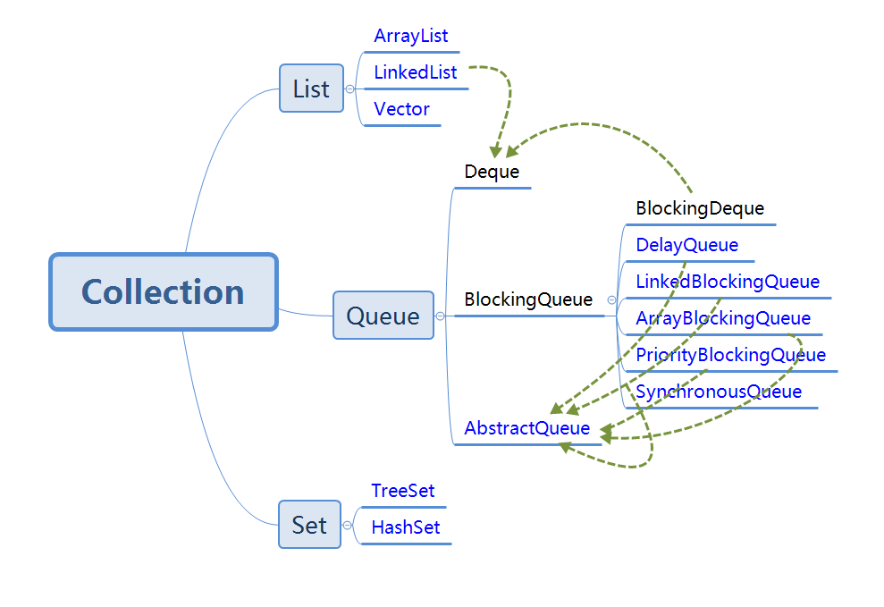
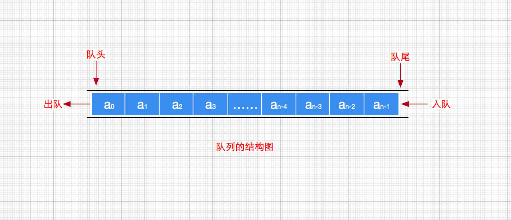
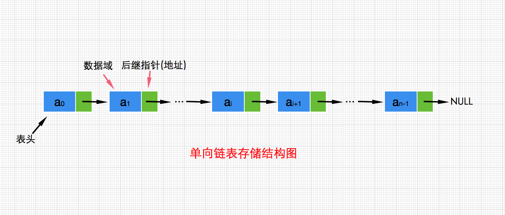
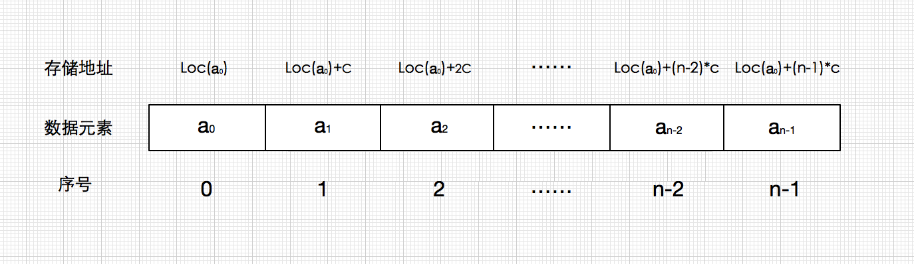
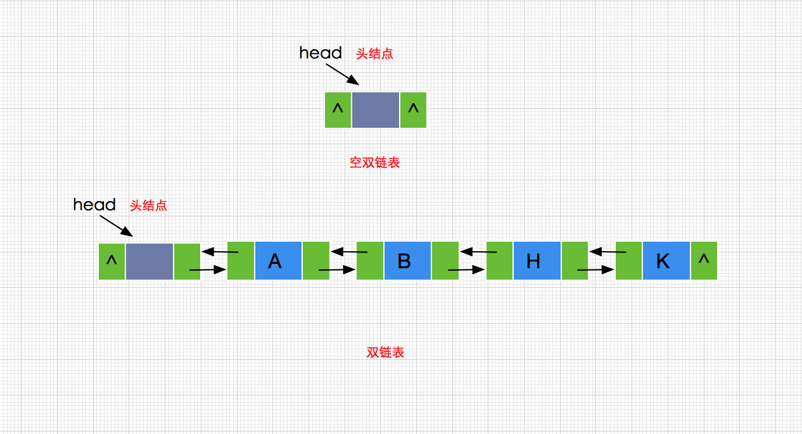
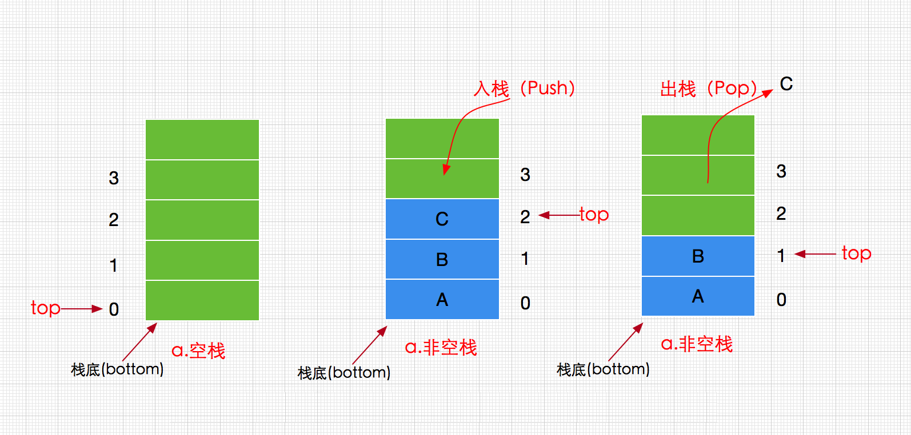

# 数据结构在java中的体现

## 绪论

  java中很多的工具类中实现了很多的数据结构的概念，stack set list queue，这些实现大多数在集合这个感念上体现的，按照下图可以看出java的集合工具
  
  
  
  从上图已经看出在java最初设计的时候就定义号了职责
  Collection 集合，这个是所有集合的超累，如果你自己想实现一个集合就可以实现这个接口。
  然后将集合细分为
  Set 散列结合，这个的定义是集合之间没有前后关系的这个只是一堆元素的集合
  List 线性集合，这个定义是集合之间是有顺序的，方便排序
  Queue 队列集合，这个的定义是集合可以进行队列进入，队列为出的特性
  
  下面就来细讲一下这几个实现
  
## Queue

队列是数据结构中比较重要的一种类型，它支持 FIFO，尾部添加、头部删除（先进队列的元素先出队列），跟我们生活中的排队类似。



其实Queue的实现从代码剖析来看应该是单链表模式



```
这是LinkedBlockingQueue 里的一块代码，就是一个单链表
/**
     * Linked list node class
     */
    static class Node<E> {
        E item;

        /**
         * One of:
         * - the real successor Node
         * - this Node, meaning the successor is head.next
         * - null, meaning there is no successor (this is the last node)
         */
        Node<E> next;

        Node(E x) { item = x; }
    }
```


有一个很好的[实践文章](https://blog.csdn.net/javazejian/article/details/53375004)，后面咱整理到自己的知识体系中


在java中有细分了这个队列的使用

### Deque

这个接口定义了是一个双端队列，可以从队列的头部操作，也可以从队列的尾部操作

### BlockingQueue

这个接口定义了他是一个阻塞队列，阻塞的所有的实现要有两个特点，1是阻塞，2是线程安全，所以衍生出来一下阻塞队列，他们都是线程安全的，但是注意用法
基本上安全的都是put和take方法。

- ArrayBlockingQueue ：一个由数组支持的有界队列。
- LinkedBlockingQueue ：一个由链接节点支持的可选有界队列。
- PriorityBlockingQueue ：一个由优先级堆支持的无界优先级队列。
- DelayQueue ：一个由优先级堆支持的、基于时间的调度队列。
- SynchronousQueue ：一个利用 BlockingQueue 接口的简单聚集（rendezvous）机制。

### AbstractQueue

这个是队列的抽象类，这里只是定义了一些抽象的公用方法。不是指责的定义。基本上所有的queue的数显都继承了这个类，但是有实现了Queue接口，这就冗余了，可以能更快捷的辨别类的定义吧。

## List

在 List 中，用户可以精确控制列表中每个元素的插入位置，另外用户可以通过整数索引（列表中的位置）访问元素，并搜索列表中的元素。 与 Set 不同，List 通常允许重复的元素。 另外 List 是有序集合而 Set 是无序集合。


对于列表的[实践文章](https://blog.csdn.net/javazejian/article/details/52953190)


### ArrayList

是一个数组队列，相当于动态数组。它由数组实现，随机访问效率高，随机插入、随机删除效率低。计算机操作系统会为该数组分配一块连续的内存块，这也就意味着数组中的每个存储单元的地址都是连续的，因此只要知道了数组的起始内存地址就可以通过简单的乘法和加法计算出数组中第n-1个存储单元的内存地址，就如下图所示：




### LinkedList 

是一个双向链表。它也可以被当作堆栈、队列或双端队列进行操作。LinkedList随机访问效率低，但随机插入、随机删除效率高，这里要提一句就是虽然是list但是这个实现非常接近queue了



```
将LinkList的关键代码列出，可以看出有两个头尾的节点，这就证明可以从头尾进行操作，并且在提供的方法中也有体现
而node这个节点可以产出有前后的引用
    /**
     * Pointer to first node.
     * Invariant: (first == null && last == null) ||
     *            (first.prev == null && first.item != null)
     */
    transient Node<E> first;

    /**
     * Pointer to last node.
     * Invariant: (first == null && last == null) ||
     *            (last.next == null && last.item != null)
     */
    transient Node<E> last;
    
    ....
    
    /**
     * Links e as first element.
     */
    private void linkFirst(E e) {
        final Node<E> f = first;
        final Node<E> newNode = new Node<>(null, e, f);
        first = newNode;
        if (f == null)
            last = newNode;
        else
            f.prev = newNode;
        size++;
        modCount++;
    }

    /**
     * Links e as last element.
     */
    void linkLast(E e) {
        final Node<E> l = last;
        final Node<E> newNode = new Node<>(l, e, null);
        last = newNode;
        if (l == null)
            first = newNode;
        else
            l.next = newNode;
        size++;
        modCount++;
    }  
      
    ...
    
    private static class Node<E> {
            E item;
            Node<E> next;
            Node<E> prev;
    
            Node(Node<E> prev, E element, Node<E> next) {
                this.item = element;
                this.next = next;
                this.prev = prev;
            }
        }
```

对于双链表很好的[实践文章](https://blog.csdn.net/javazejian/article/details/53047590)

### Vector 

是矢量队列，和ArrayList一样，它也是一个动态数组，由数组实现。但是ArrayList是非线程安全的，而Vector是线程安全的。

### Stack 

是栈，它继承于Vector。它的特性是：先进后出(FILO, First In Last Out)。



## Set

Set 继承于 Collection 接口，是一个不允许出现重复元素，并且无序的集合，主要 HashSet 和 TreeSet 两大实现类。

在判断重复元素的时候，HashSet 集合会调用 hashCode()和 equal()方法来实现；TreeSet 集合会调用compareTo方法来实现。

### HashSet

是哈希表结构，主要利用 HashMap 的 key 来存储元素，计算插入元素的 hashCode 来获取元素在集合中的位置；

### TreeSet

是红黑树结构，主要使用TreeMap来实现的，每一个元素都是树中的一个节点，插入的元素都会进行排序；