# 树的详解

在数据结构中也提到树了，但是因为红黑树（平衡二叉树的一种实现）、B-、B+、B*树的这种衍生的数据结构比较复杂所以在此详细解释

## 红黑树

红黑树是一个平衡二叉树的实现，是为了在查找节点的时间效率（O(log2n)）,但是为了保证平衡红黑树在插入和删除的时候要做很多操作。下面我们就来讲讲红黑树

**首先红黑树的特点**

1. 节点是红色或黑色。
2. 根节点是黑色。
3. 每个叶子节点都是黑色的空节点（NIL节点）。
4. 每个红色节点的两个子节点都是黑色。(从每个叶子到根的所有路径上不能有两个连续的红色节点)
5. 从任一节点到其每个叶子的所有路径都包含相同数目的黑色节点。

这样就能保证根节点到叶子节点最长路径不会超过最短路径的两倍

下图中这棵树，就是一颗典型的红黑树：

什么情况下会破坏红黑树的规则，什么情况下不会破坏规则呢？我们举两个简单的例子：

1.向原红黑树插入值为14的新节点：

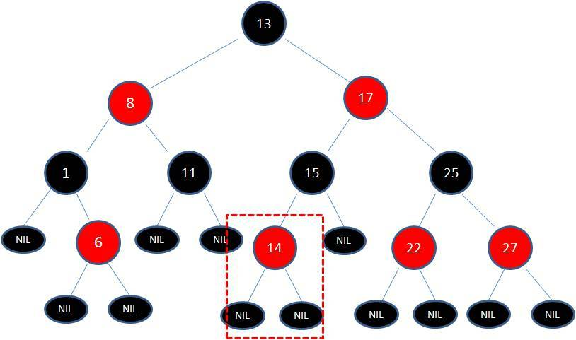

由于父节点15是黑色节点，因此这种情况并不会破坏红黑树的规则，无需做任何调整。

2.向原红黑树插入值为21的新节点：

由于父节点22是红色节点，因此这种情况打破了红黑树的规则4（每个红色节点的两个子节点都是黑色），必须进行调整，使之重新符合红黑树的规则。

调整红黑树符合规则有两种方式：变色和旋转，而旋转又分为左权转和有旋转

**变色**：

为了重新符合红黑树的规则，尝试把红色节点变为黑色，或者把黑色节点变为红色。

下图所表示的是红黑树的一部分，需要注意节点25并非根节点。因为节点21和节点22连续出现了红色，不符合规则4，所以把节点22从红色变成黑色：

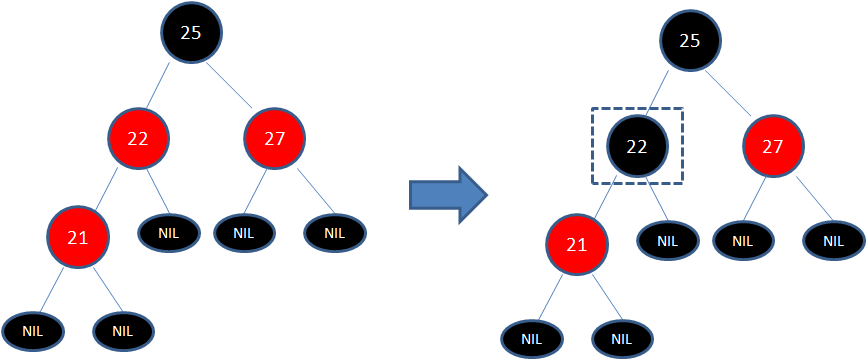

但这样并不算完，因为凭空多出的黑色节点打破了规则5，所以发生连锁反应，需要继续把节点25从黑色变成红色：

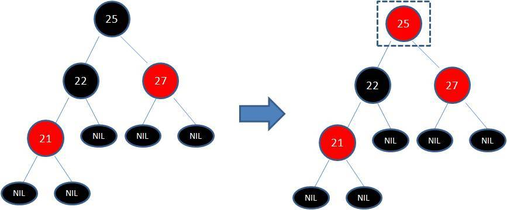

此时仍然没有结束，因为节点25和节点27又形成了两个连续的红色节点，需要继续把节点27从红色变成黑色：

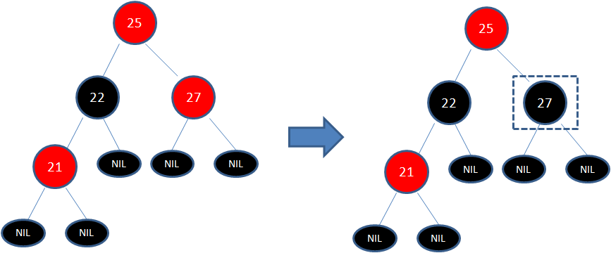

**左旋转**：

**逆时针**旋转红黑树的两个节点，使得父节点被自己的右孩子取代，而自己成为自己的左孩子。说起来很怪异，大家看下图：

图中，身为右孩子的Y取代了X的位置，而X变成了自己的左孩子。此为左旋转。

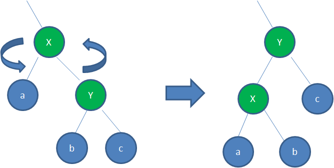

**右旋转**：

**顺时针**旋转红黑树的两个节点，使得父节点被自己的左孩子取代，而自己成为自己的右孩子。大家看下图：

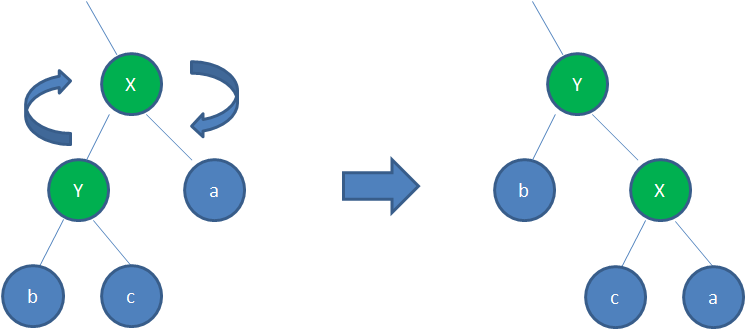

图中，身为左孩子的Y取代了X的位置，而X变成了自己的右孩子。此为右旋转。

因为红黑树为了保证平衡在插入和删除要做很多的变色旋转的过程，下面以最一开始的例子来了解插入带来的变色和选择的过程

我们以刚才插入节点21的情况为例：

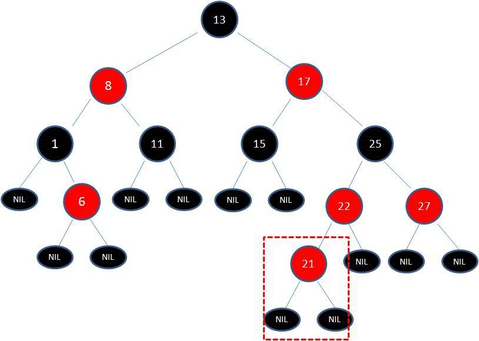

首先，我们需要做的是变色，把节点25及其下方的节点变色：

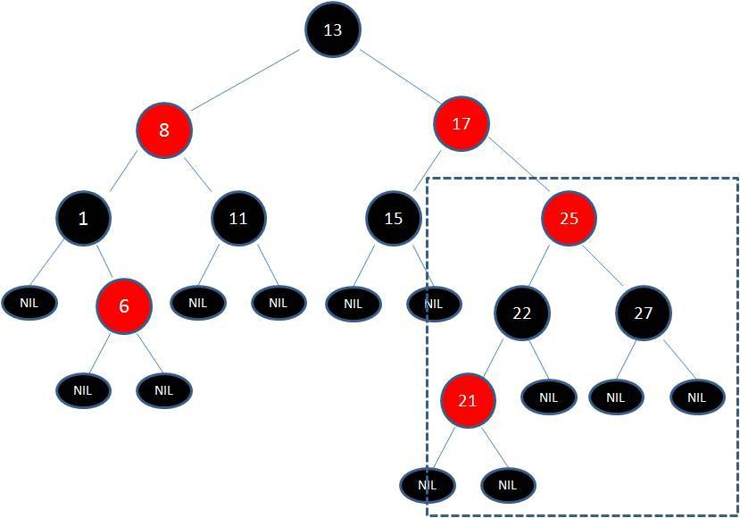

此时节点17和节点25是连续的两个红色节点，那么把节点17变成黑色节点？恐怕不合适。这样一来不但打破了规则4，而且根据规则2（根节点是黑色），也不可能把节点13变成红色节点。

变色已无法解决问题，我们把节点13看做X，把节点17看做Y，像刚才的示意图那样进行左旋转：

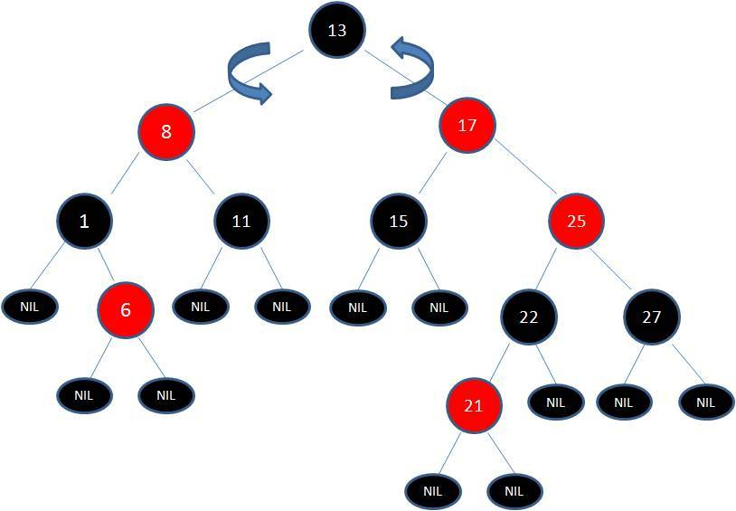

左旋转完成后就变成下面的样子了

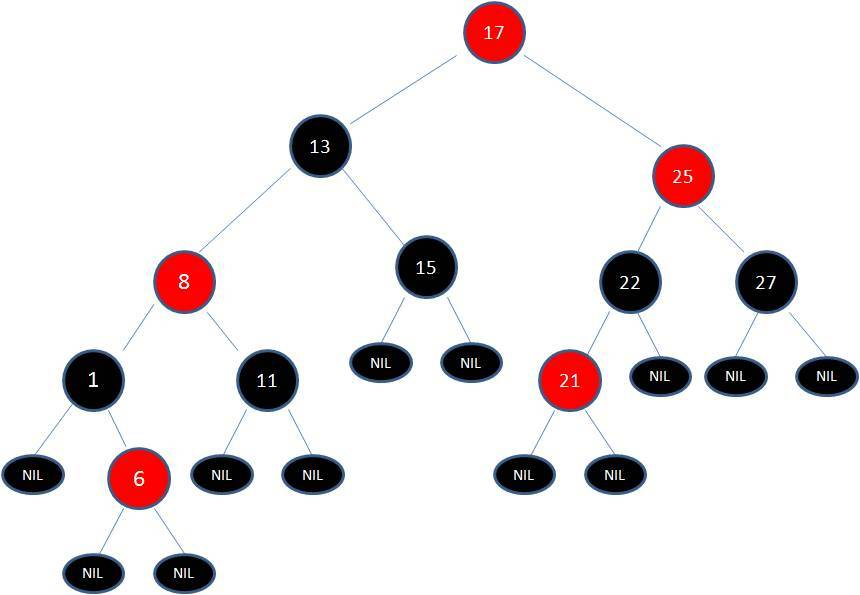

由于根节点必须是黑色节点，所以需要变色，变色结果如下：

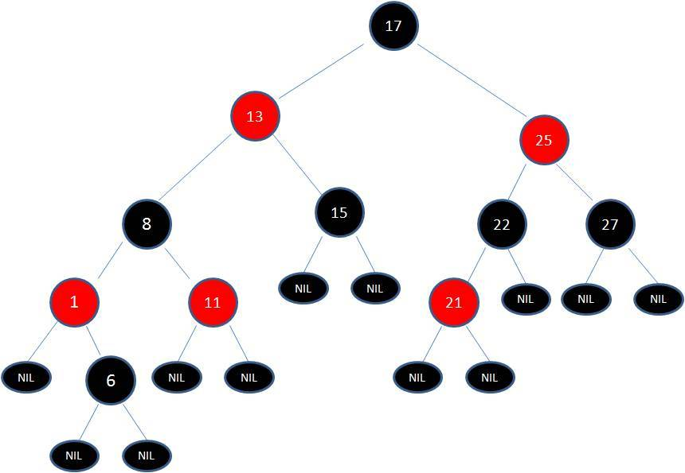

这样就结束了吗？并没有。因为其中两条路径(17 -> 8 -> 6 -> NIL)的黑色节点个数是4，其他路径的黑色节点个数是3，不符合规则5。

这时候我们需要把节点13看做X，节点8看做Y，像刚才的示意图那样进行右旋转：

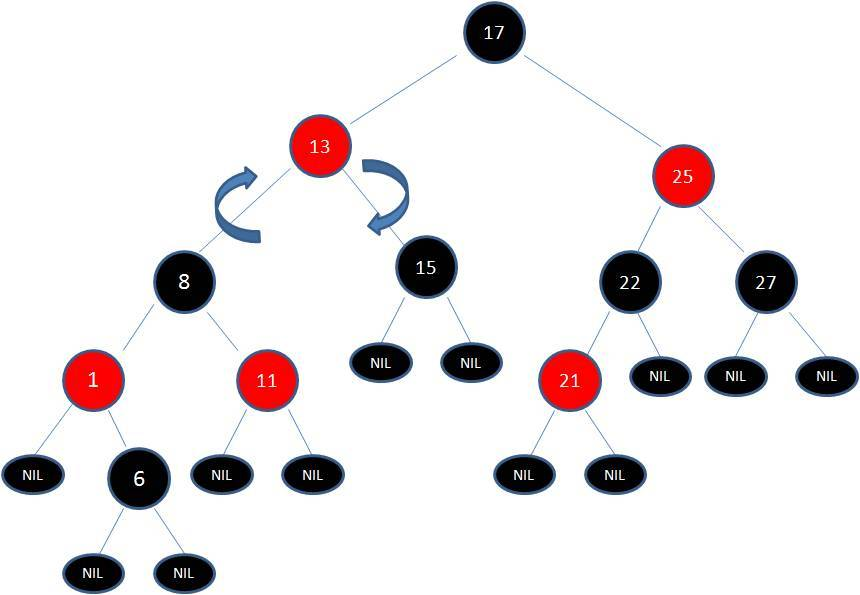

右旋转完成后就变成下面的样子了

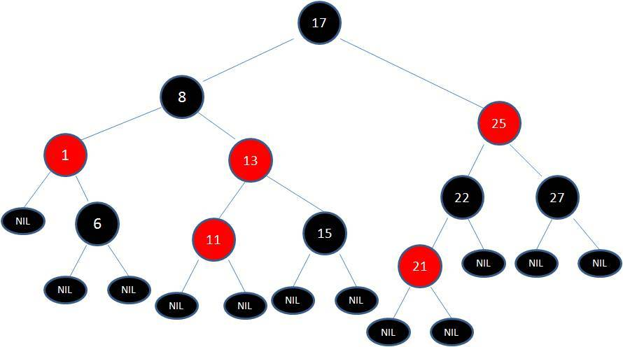

最后根据规则来进行变色：

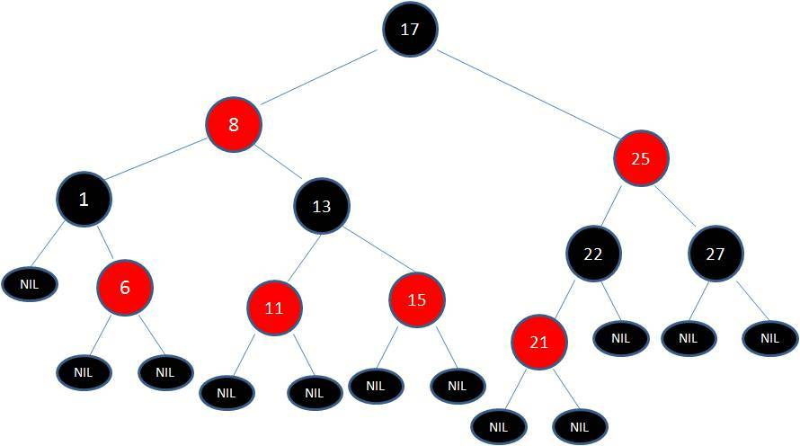

如此一来，我们的红黑树变得重新符合规则。这一个例子的调整过程比较复杂，经历了如下步骤：

变色 -> 左旋转 -> 变色 -> 右旋转 -> 变色

## B-树

B-树是一种多路搜索树（并不一定是二叉的），也可称为B树

一棵m阶B树(balanced tree of order m)是一棵平衡的m路搜索树。它或者是空树，或者是满足下列性质的树：

1. 根结点至少有两个子女；

2. 每个非根节点所包含的关键字个数 j 满足：m/2 - 1 <= j <= m - 1；

3. 除根结点以外的所有结点（不包括叶子结点）的度数正好是关键字总数加1，故内部子树个数 k 满足：m/2 <= k <= m ；

4. 所有的叶子结点都位于同一层。

**特点**：

是一种多路搜索树（并不是二叉的）：

1. 定义任意非叶子结点最多只有M个儿子；且M>2；

2. 根结点的儿子数为[2, M]；

3. 除根结点以外的非叶子结点的儿子数为[M/2, M]；

4. 每个结点存放至少M/2-1（取上整）和至多M-1个关键字；（至少2个关键字）

5. 非叶子结点的关键字个数=指向儿子的指针个数-1；

6. 非叶子结点的关键字：K[1], K[2], …, K[M-1]；且K[i] < K[i+1]；

7. 非叶子结点的指针：P[1], P[2], …, P[M]；其中P[1]指向关键字小于K[1]的子树，P[M]指向关键字大于K[M-1]的子树，其它P[i]指向关键字属于(K[i-1], K[i])的子树；

8. 所有叶子结点位于同一层；

如：（M=3）

B-树的搜索，从根结点开始，对结点内的关键字（有序）序列进行二分查找，如果命中则结束，否则进入查询关键字所属范围的儿子结点；重复，直到所对应的儿子指针为空，或已经是叶子结点；

**B-树的特性**：

1. 关键字集合分布在整颗树中；

2. 任何一个关键字出现且只出现在一个结点中；

3. 搜索有可能在非叶子结点结束；

4. 其搜索性能等价于在关键字全集内做一次二分查找；

5. 自动层次控制；

## B+树

B+ 树是一种树数据结构，是一个n叉树，每个节点通常有多个孩子，一棵B+树包含根节点、内部节点和叶子节点。根节点可能是一个叶子节点，也可能是一个包含两个或两个以上孩子节点的节点。

**用途**：

B+ 树通常用于数据库和操作系统的文件系统中。NTFS, ReiserFS, NSS, XFS, JFS, ReFS 和BFS等文件系统都在使用B+树作为元数据索引。B+ 树的特点是能够保持数据稳定有序，其插入与修改拥有较稳定的对数时间复杂度。B+ 树元素自底向上插入。

**B+树的定义**

B+树是应文件系统所需而出的一种B-树的变型树。一棵m阶的B+树和m阶的B-树的差异在于：

1. 有n棵子树的结点中含有n个关键字，每个关键字不保存数据，只用来索引，所有数据都保存在叶子节点。

2. 所有的叶子结点中包含了全部关键字的信息，及指向含这些关键字记录的指针，且叶子结点本身依关键字的大小自小而大顺序链接。

3. 所有的非终端结点可以看成是索引部分，结点中仅含其子树（根结点）中的最大（或最小）关键字。 

通常在B+树上有两个头指针，一个指向根结点，一个指向关键字最小的叶子结点。

B+树是B-树的变体，也是一种多路搜索树：

1. 其定义基本与B-树同，除了：

2. 非叶子结点的子树指针与关键字个数相同；

3. 非叶子结点的子树指针P[i]，指向关键字值属于[K[i], K[i+1])的子树（B-树是开区间）；

5. 为所有叶子结点增加一个链指针；

6. 所有关键字都在叶子结点出现；

如：（M=3）

B+的搜索与B-树也基本相同，区别是B+树只有达到叶子结点才命中（B-树可以在非叶子结点命中），其性能也等价于在关键字全集做一次二分查找；

**B+的特性**：

1.所有关键字都出现在叶子结点的链表中（稠密索引），且链表中的关键字恰好是有序的；

2.不可能在非叶子结点命中；

3.非叶子结点相当于是叶子结点的索引（稀疏索引），叶子结点相当于是存储

（关键字）数据的数据层；

4.更适合文件索引系统；

## B*树：

是B+树的变体，在B+树的非根和非叶子结点再增加指向兄弟的指针；

B*树定义了非叶子结点关键字个数至少为(2/3)*M，即块的最低使用率为2/3（代替B+树的1/2）；

B+树的分裂：当一个结点满时，分配一个新的结点，并将原结点中1/2的数据复制到新结点，最后在父结点中增加新结点的指针；B+树的分裂只影响原结点和父结点，而不会影响兄弟结点，所以它不需要指向兄弟的指针；

B*树的分裂：当一个结点满时，如果它的下一个兄弟结点未满，那么将一部分数据移到兄弟结点中，再在原结点插入关键字，最后修改父结点中兄弟结点的关键字（因为兄弟结点的关键字范围改变了）；

如果兄弟也满了，则在原结点与兄弟结点之间增加新结点，并各复制1/3的数据到新结点，最后在父结点增加新结点的指针；

所以，B*树分配新结点的概率比B+树要低，空间使用率更高；

## 小结：

### B-树：

多路搜索树，每个结点存储M/2到M个关键字，非叶子结点存储指向关键字范围的子结点；

所有关键字在整颗树中出现，且只出现一次，非叶子结点可以命中；

### B+树：

在B-树基础上，为叶子结点增加链表指针，所有关键字都在叶子结点中出现，非叶子结点作为叶子结点的索引；B+树总是到叶子结点才命中；

### B*树：

在B+树基础上，为非叶子结点也增加链表指针，将结点的最低利用率从1/2提高到2/3；

